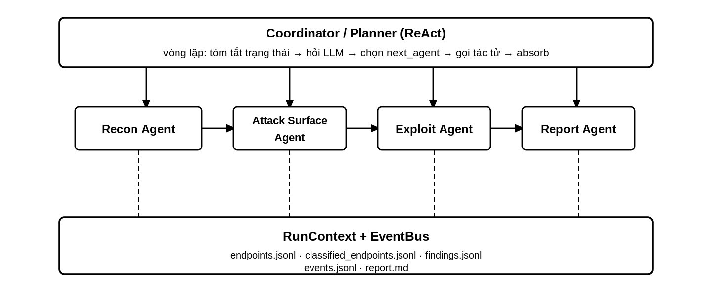
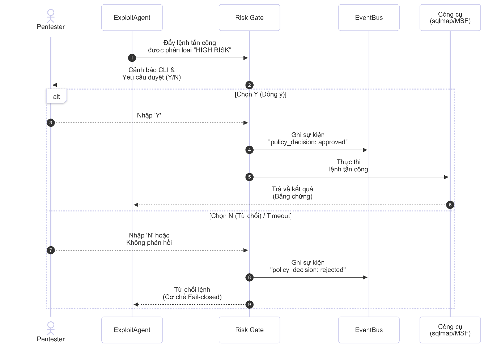
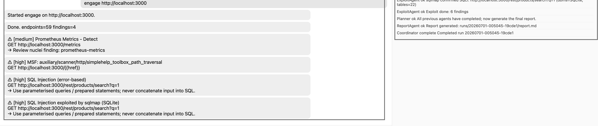

## Abstract

The idea of giving a large language model a target and asking it to “perform a penetration test” is attractive but technically incomplete. A useful security assessment requires more than natural-language reasoning: it must preserve authorization boundaries, collect and normalize a large attack surface, select compatible tools, separate hypotheses from verified evidence, control intrusive operations, and retain a complete audit trail. An unconstrained language model provides none of these guarantees by itself.

This paper presents the design, implementation, and empirical evaluation of a local-first multi-agent system for authorized web application security assessment. The system decomposes the workflow into four specialized agents for reconnaissance, attack-surface analysis, controlled validation, and reporting. A central planner follows a bounded ReAct loop and coordinates these agents through a shared `RunContext`. Retrieval-augmented generation supplies local knowledge from Nuclei templates and Metasploit module metadata, while deterministic policy components enforce scope, resource limits, and human approval for high-risk actions. All session state, decisions, and findings are stored as structured artifacts and append-only JSONL events.

The system was evaluated in two complementary environments. On a local OWASP Juice Shop instance, it collected 195 endpoint observations, retained 59 endpoints above a risk threshold of 0.3, produced six raw tool findings, and reduced them to four reportable records after normalization and deduplication. The strongest result was an SQL injection chain independently supported by an active validator and sqlmap, which identified SQLite and enumerated 22 tables. A second evaluation on a larger authorized web environment processed 286 hosts and 1,711 endpoint observations, retained 55 risk-ranked endpoints, and reported one low-severity weak-cipher configuration without claiming an unverified exploit.

The implementation history is as important as the final result. Five consecutive experimental revisions increased the final finding count from zero to four. The decisive improvements were not larger prompts or a larger model; they were correct scanner arguments, JSONL parsing, risk-tag translation, preservation of non-default ports, active validation, and evidence retention. These results support a restrained conclusion: local LLMs are useful as reasoning and navigation layers around deterministic security tools, but reliability and safety still depend primarily on software architecture, explicit policy, and reproducible evidence.

**Keywords:** multi-agent systems, penetration testing, local LLM, ReAct, retrieval-augmented generation, attack-surface management, Nuclei, Metasploit, human-in-the-loop

**Artifact provenance.** The quantitative results and optimization history in this paper are reconstructed from the final project report and its recorded run artifacts. The `PENTESTAI` directory accompanying this post is a locally staged source snapshot for architectural inspection and educational reuse. It represents the same project lineage, but it is not the exact final experiment revision: the report describes additional deterministic classifier rules, tag-driven scanner selection, active SQL-injection validation, sqlmap integration, and terminal ReportAgent behavior that are not all present in this snapshot. Exact reproduction of the four-finding run therefore requires the final experiment revision, pinned tool/model artifacts, and the retained run directory described in Section 20.

## 1. Introduction

Web penetration testing is often described as a sequence of reconnaissance, scanning, exploitation, and reporting. In practice, the difficult part is the continuous interpretation between those stages. Reconnaissance produces hosts, ports, URLs, parameters, JavaScript routes, API specifications, technology fingerprints, and inconsistent scanner records. A tester must decide which observations are real, which ones represent the same underlying surface, what should be tested next, and when the available evidence is sufficient to support a finding.

Traditional automation improves speed but does not solve this reasoning problem. Signature-based scanners can inspect thousands of requests, yet their output remains fragmented across different schemas and confidence models. One tool may label an endpoint as an exposure, another may return a product-specific template match, and a third may require a carefully constructed request before it can validate the same hypothesis. The operator becomes the integration layer.

Large language models appear well suited to this gap because they can summarize heterogeneous text, recognize semantic relationships, and propose context-dependent actions. However, using an LLM as an autonomous offensive operator introduces a second class of problems:

- The model can hallucinate endpoints, modules, commands, and vulnerabilities.
- Structured JSON output is not consistently structured, especially with smaller local models.
- A semantically plausible exploit may target the wrong product or version.
- Long conversations lose state or reinterpret previous observations.
- Prompt-level safety instructions cannot enforce network scope or prevent destructive execution.
- Fluent report prose can hide weak or nonexistent evidence.

The central research question of this work is therefore narrower than full autonomous penetration testing:

> Can a local language model coordinate a bounded, reproducible web security workflow while deterministic components retain authority over scope, execution, evidence, and risk?

I approached the project as a systems problem rather than a prompting exercise. The LLM was assigned tasks that benefit from semantic reasoning, while ordinary code handled tasks that require invariants. The implementation was then evaluated not only by the number of findings but also by its ability to preserve target fidelity, recover from malformed model output, terminate deterministically, retain evidence, and fail closed on high-risk actions.

## 2. Research Questions and Contributions

The work is organized around five research questions.

**RQ1: Coordination.** Can specialized agents coordinated through a bounded planner manage a complete assessment without relying on one long conversational context?

**RQ2: Robustness.** Can deterministic rules, schema coercion, batching, and persistent state compensate for the instability of a 7-billion-parameter local model?

**RQ3: Grounding.** Can retrieval and fixed tool vocabularies reduce hallucinated scanner or exploit selection?

**RQ4: Safety.** Can authorization scope and high-risk actions remain enforceable even when the model proposes an unsafe step?

**RQ5: Practical value.** In the end-to-end result, how much improvement comes from AI reasoning and how much comes from conventional integration engineering?

The principal contributions are:

1. A local-first multi-agent architecture that separates planning, execution, policy, evidence, and reporting.
2. A session model that stores structured state and append-only events outside the LLM context window.
3. A bounded ReAct coordinator with safe fallback behavior for invalid planner output.
4. A hybrid attack-surface strategy combining deterministic signals with LLM enrichment.
5. A retrieval layer over locally available Nuclei and Metasploit knowledge.
6. A fail-closed approval mechanism for high-impact offensive actions.
7. An empirical account of five integration revisions that changed a zero-finding pipeline into an evidence-producing workflow.

This is an engineering case study, not a claim of state-of-the-art vulnerability coverage. The experiments demonstrate feasibility and expose failure modes; they do not establish superiority over professional manual testing or commercial scanners.

## 3. Scope, Assumptions, and Terminology

The system is intended only for targets that the operator owns or is explicitly authorized to assess. Authorization is treated as a prerequisite supplied outside the model. The implementation enforces the declared technical scope, but it cannot determine whether the person starting a run has legal permission.

The following terms are used carefully throughout the paper:

- An **observation** is raw information collected by reconnaissance or a tool.
- A **hypothesis** is an inferred vulnerability class assigned to an endpoint.
- A **candidate action** is a proposed scanner, template, module, or validator invocation.
- A **tool result** is a structured record emitted after execution.
- A **validated finding** contains evidence that supports the vulnerability claim.
- A **reportable finding** is a normalized record retained after deduplication and human-oriented review.

This distinction matters because a model-generated risk tag is not a vulnerability. Similarly, a template match may still require product compatibility or manual confirmation. The system's data flow is designed to preserve these different epistemic states rather than collapsing them into a single confidence score.

The threat model includes accidental out-of-scope execution, malformed LLM output, incorrect module selection, scanner failures, target normalization errors, duplicated findings, and unsupported claims in the final report. It does not attempt to defend a fully compromised host running the assessment, a malicious tool binary, or a malicious operator who deliberately changes policy code.

## 4. Design Requirements

The architecture was derived from eight requirements.

| ID | Requirement | Operational meaning |
|---|---|---|
| R1 | Local-first processing | Recon data and prompts remain on the assessment workstation |
| R2 | Explicit scope | Every accepted target must satisfy scheme and host policy |
| R3 | Bounded autonomy | Planner and exploit phases have hard step and target limits |
| R4 | Separation of concerns | Planning cannot directly execute arbitrary commands |
| R5 | Evidence retention | Findings must point to stored tool or validator output |
| R6 | Failure transparency | Parsing, tool, and policy failures must emit events |
| R7 | Human control | High-risk operations require affirmative approval |
| R8 | Reproducibility | Each run must produce an isolated set of machine-readable artifacts |

The most important design decision is the separation between *semantic discretion* and *operational authority*. The model may rank an endpoint or choose among retrieved candidates. It does not decide whether a URL is in scope, whether a destructive operation may execute, how a command is escaped, or whether missing approval means consent.

## 5. System Overview

The system consists of a coordinator, four task agents, deterministic tool wrappers, a policy layer, a retrieval layer, and session-scoped storage.



The high-level data flow is:

```text
Authorized target + run configuration
                 |
                 v
        Scope and limit checks
                 |
                 v
        Bounded ReAct planner
                 |
      +----------+-----------+-------------+
      |                      |             |
      v                      v             v
 ReconAgent       AttackSurfaceAgent   ExploitAgent
      |                      |             |
      +-----------> shared RunContext <----+
                             |
                             v
                        ReportAgent
                             |
                             v
         report.md + JSONL artifacts + metadata
```

The coordinator creates a new `runs/<run_id>` directory and refuses to overwrite an existing run. It initializes an `EventBus`, subscribes a JSONL writer, validates the target, and constructs a `RunContext`. The planner then selects agents until it reaches a stop condition or the maximum step count. If no report was produced, the orchestrator invokes the reporting agent as a final fallback.

### 5.1 Agent responsibilities

| Agent | Input | Main operation | Output |
|---|---|---|---|
| `ReconAgent` | Target and limits | External recon, OpenAPI discovery, normalization, summary | Hosts, technologies, endpoint observations |
| `AttackSurfaceAgent` | Recon state and endpoints | Rule-based scoring, LLM enrichment, filtering | Ranked `ClassifiedEndpoint` records |
| `ExploitAgent` | Top-ranked endpoints | Retrieval, scanner selection, controlled validation | Evidence-bearing `Finding` records |
| `ReportAgent` | Scope, endpoints, findings | Severity count, finding rendering, artifact references | Markdown report |

Agents return structured `AgentResult` objects. The context absorbs those objects into explicit fields rather than appending prose to a conversation. This makes the output of one stage inspectable before it becomes the input of another.

### 5.2 Layered source organization

The implementation is divided by responsibility:

```text
PENTESTAI/
├── agents/         specialized workflow agents
├── benchmark/      Juice Shop scoring and expected-result support
├── config/         safe defaults and runtime overrides
├── coordinator/    planner state and prompts
├── domain/         endpoints, findings, events, and phases
├── llm/            local model interface and structured calls
├── pipeline/       orchestration, context, and event bus
├── policy/         scope and permission enforcement
├── rag/            ChromaDB retrieval and index construction
├── recon/          API and endpoint discovery helpers
├── storage/        per-run artifact persistence
└── tools/          Osmedeus, Nuclei, Metasploit, and risk wrappers
```

This structure allows a tool or agent to be replaced without redefining the complete workflow. It also gives the policy layer an ownership boundary separate from model-facing code.

## 6. State and Evidence Model

### 6.1 Shared run context

`RunContext` is the short-term memory of an assessment. It stores:

```text
target, config, run_id, run_dir
recon_result, endpoints, classified endpoints
findings, plan steps, pending approvals
tag counts, authentication sessions, report path
engage mode and target-restart status
```

Accessors return copies for mutable collections where practical, reducing accidental cross-agent mutation. Agent results are merged through an explicit `absorb` operation.

This design addresses a central limitation of conversational agents. If the workflow depended on the model remembering 1,711 endpoints in prompt history, state would be expensive, truncated, and difficult to audit. Instead, the model sees compact summaries while the full data remains in structured storage.

### 6.2 Endpoint and finding schemas

An endpoint is represented by URL, method, parameter names, source, content type, authentication state, status code, and optional risk tags. A finding contains a title, weakness type, severity, confidence, endpoint, method, evidence dictionary, and recommendation.

The separation is deliberate. An endpoint may be high priority without being vulnerable. A finding should exist only after an execution or validator returns evidence.

### 6.3 Append-only event provenance

Every important transition emits an `AgentEvent` with a timestamp, type, agent, step number, tool, status, message, and optional structured data. Typical event types include:

```text
session_start, coordinator_plan, step_start, tool_done,
tool_error, policy_decision, finding, report_done, session_done
```

Events are written one object per line to `events.jsonl`. JSONL was selected because it can be streamed and partially recovered. A truncated final line does not invalidate earlier events, and a long-running interface can tail the file without loading a monolithic document.

The event log answers questions that prose cannot answer reliably: Which agent selected a tool? Was the operation actually executed? Did the risk gate block it? Was the report created after or before a finding existed?

### 6.4 Per-run artifact layout

Each completed session retains:

| Artifact | Purpose |
|---|---|
| `events.jsonl` | Chronological planner, agent, tool, and policy events |
| `endpoints.jsonl` | Normalized reconnaissance observations |
| `classified_endpoints.jsonl` | Risk-ranked hypotheses and reasons |
| `findings.jsonl` | Normalized evidence-bearing findings |
| `run.json` or equivalent metadata | Configuration, counts, timing, decisions, approvals |
| `report.md` | Human-readable report |
| `score.json` | Benchmark result when benchmark mode is used |

This layout is also the foundation for regression testing: changes to parsing or classification can be compared between runs without repeating every manual observation.

## 7. Bounded ReAct Coordination

The planner implements a restricted Observe-Reason-Act loop. At iteration `t`, it receives a compact state summary:

```text
S_t = {
  target,
  recon_completed,
  classified_count,
  finding_count,
  agents_already_run
}
```

The local model maps this state to a structured plan step:

```text
P_t = {next_agent, args, reason, stop}
```

Only registered agent names are executable. The planner itself has no shell capability. After the selected agent completes, its structured result updates the context and produces the next state `S_(t+1)`.

```text
Algorithm 1: Bounded coordinator

input: context C, registered agents A, maximum steps T
for t in 1..T:
    summary <- summarize(C)
    raw <- structured_llm_call(summary)
    step <- parse_or_safe_fallback(raw)
    append step to C.plan_steps
    emit coordinator_plan event
    if step.stop: break
    if step.next_agent not in A:
        emit error and break
    result <- A[step.next_agent].run(C)
    C.absorb(result)
if C.report_path is empty:
    run ReportAgent once
```

### 7.1 Safe handling of invalid plans

If planner output is invalid JSON or is not an object, the parser returns a conservative fallback that points to the reporting stage and requests termination. Unknown agent names produce an error event and stop the loop. The maximum-step bound prevents infinite cycles.

The evaluated prototype also treated report generation as the semantic terminal stage. This was introduced after observing that the 7B model did not reliably set `stop=true` and could repeat a Report/Exploit pattern. The current code retains two independent guarantees: a hard maximum and a final report fallback. The broader lesson is that termination is an application invariant, not a behavior that should be delegated entirely to a generative model.

### 7.2 Observed plan

For the final Juice Shop run, the coordinator selected the expected four-stage path:

```text
Recon -> Attack Surface -> Exploit -> Report
```

Only four decisions were needed despite a configured allowance of twelve. The surplus step budget provided recovery room without forcing unnecessary iterations.

## 8. Reconnaissance and Surface Construction

The reconnaissance agent combines external discovery with application-aware enumeration.

### 8.1 Osmedeus integration

An `OsmedeusExecutor` performs the main recon workflow and parses hosts, web records, and technology observations. Each web record becomes a typed endpoint containing its source, status code, and content type when available.

If external reconnaissance fails, the agent emits a tool error and degrades to empty results instead of crashing the entire orchestration. This permits later stages to produce an explicit empty report and retained diagnostics.

### 8.2 OpenAPI discovery

OpenAPI discovery runs as a complementary source. Its URLs are merged with Osmedeus records and deduplicated by URL. This matters because generic crawling and API specification discovery observe different surfaces: one sees linked behavior, while the other may expose routes not directly reachable from the rendered application.

### 8.3 JavaScript-derived endpoints

The evaluated system also extracted routes from JavaScript bundles. This increased coverage on a single-page application such as Juice Shop, but it created noise. Regex extraction can mistake fragments such as dynamic string expressions or template placeholders for real URLs. These false endpoints consume classification calls and can distort risk ranking.

### 8.4 Recon summary

The raw host, technology, and endpoint counts are passed to the local model for a concise summary of services, versions, and notable surface areas. This summary is not treated as evidence. It is a compression artifact used later in retrieval queries and planner context.

## 9. Hybrid Attack-Surface Classification

The final experimental design used two layers: a deterministic scoring floor and LLM-based semantic enrichment. The reason is simple: clear structural signals should not disappear because a model produced malformed output or assigned a lower score.

### 9.1 Deterministic scoring layer

For an endpoint `e`, the rule layer computes a bounded score:

```text
r_rule(e) = clip(
    0.5 * I[live API endpoint]
  + 0.3 * I[sensitive-path marker]
  + 0.2 * I[query parameters]
  + 0.2 * I[HTML response with parameters]
  + delta_status(e),
  0, 1
)
```

Here `I[condition]` is an indicator function. Authentication-gated responses such as 401 or 403 reduce the score, while server errors can raise it. Rules also assign labels:

- Live `/api/` routes suggest `idor` review.
- `.git`, backup, `.env`, `/ftp/`, `/admin`, and configuration paths suggest `misconfig`.
- Query parameters suggest `sqli` testing.
- Parameters named like `file`, `path`, `dir`, `page`, `doc`, `template`, or `url` add `path_traversal` relevance.
- HTML responses with parameters increase `xss` relevance.

The host identity is derived from URL `netloc`, preserving a non-default port. This detail later proved essential.

### 9.2 Endpoint deduplication

Before semantic enrichment, endpoints are deduplicated using a surface signature:

```text
signature(e) = (
    HTTP method,
    URL path without query values,
    set of parameter names,
    status code
)
```

Thus `/search?q=1` and `/search?q=2` are treated as the same attack surface when their method and status are equal. A different path, parameter set, method, or status remains distinct. This reduces repeated model calls without discarding the structural properties used for vulnerability selection.

### 9.3 LLM enrichment

The model receives small endpoint batches and must return JSON records with a fixed risk vocabulary. The implementation accepts three common response shapes: a direct array, a single endpoint object, or an envelope under `endpoints`, `results`, or `classifications`.

The batch size is deliberately small. During development, long arrays were frequently truncated or malformed by `qwen2.5:7b`. Small-batch classification and limited retries produced shorter, more stable responses. Different prototype revisions used batches between five and ten endpoints; the staged implementation uses ten.

The valid label set is constrained to:

```text
sqli, rce, path_traversal, xss, idor, misconfig, auth_bypass
```

Descriptive synonyms may be semantically correct but are discarded if they cannot be mapped safely. This sacrifices some model expressiveness in exchange for stable downstream behavior.

### 9.4 Merge rule and selection threshold

The hybrid score is defined as:

```text
r(e) = max(r_rule(e), r_llm(e))
tags(e) = tags_rule(e) union valid(tags_llm(e))
```

An endpoint proceeds to validation when:

```text
r(e) > tau, where tau = 0.3
```

Using the deterministic score as a floor protects strong, explainable signals from being downgraded by a weak model response. The threshold is intentionally a prioritization threshold, not a claim of vulnerability probability.

### 9.5 Known schema failure

One observed output defect converted a string-valued `matched_nuclei` field into a list of individual characters because the normalizer treated the string as a generic iterable. It did not change the final Juice Shop findings because validation used risk tags instead of that field. Nevertheless, it exposes an important rule for LLM pipelines: syntactically valid JSON still requires strict field-level type validation.

## 10. Retrieval-Augmented Security Knowledge

The system uses ChromaDB as a local vector store and `nomic-embed-text` through Ollama for embeddings. Two collections are defined:

1. `nuclei_templates`, containing template identifiers, names, severities, tags, and descriptions.
2. `msf_modules`, containing module names, types, ranks, descriptions, and metadata.

For a query `q`, ChromaDB returns the nearest items by embedding distance. The implementation exposes a simple similarity-like value:

```text
score(q, d) = 1 / (1 + distance(q, d))
```

The score is useful for ordering but should not be interpreted as calibrated exploit compatibility.

### 10.1 Index construction

Nuclei YAML templates are parsed for `id`, `name`, `severity`, and `tags`; malformed templates are skipped. Metasploit search output is parsed into module type, rank, name, and description before indexing. The collections persist locally under `.chroma`.

### 10.2 Retrieval during classification

The attack-surface agent builds a query from the recon summary and observed technology stack. It retrieves up to eight results from each collection and supplies the descriptions as context while endpoints are classified.

### 10.3 Retrieval during validation

For each of the top ten classified endpoints, the exploit agent builds a query from the host and risk tags. It retrieves up to five Nuclei and five Metasploit candidates, then asks the model to select only from the supplied list.

### 10.4 Tag-based Nuclei selection

The evaluated prototype found that allowing the LLM to guess exact template identifiers was brittle. The stronger path mapped the classifier's conceptual risk tags to Nuclei tags:

| Risk label | Nuclei tag set |
|---|---|
| `sqli` | `sqli`, `injection` |
| `xss` | `xss` |
| `rce` | `rce` |
| `path_traversal` | `lfi`, `traversal` |
| `idor` | `idor` |
| `misconfig` | `misconfig`, `exposure` |
| `auth_bypass` | `auth`, `default-login` |

Risk tags are aggregated per host so Nuclei can run one tag-filtered scan instead of one scan per endpoint. This lets Nuclei resolve the installed templates and avoids repeated scans against the same host.

### 10.5 Retrieval limitations

The experimental Nuclei collection contained thousands of templates, but Metasploit retrieval was much less complete. Textual similarity also lacks a hard product/version constraint. This weakness surfaced when a SimpleHelp traversal module was associated with a Node.js/Express application. Retrieval grounded the module name but did not establish compatibility. A technology filter must therefore sit between semantic retrieval and execution.

## 11. Controlled Validation and Evidence Production

The exploit stage is enabled only in `engage` mode. When disabled, the agent emits a policy event and returns without executing validators.

When enabled, the stage is bounded to the highest-ranked endpoints, with ten targets in the main experiment. It combines multiple sources of evidence:

- Nuclei template scanning selected through risk-tag translation.
- Metasploit module checks or execution when a compatible executor is available.
- sqlmap for SQL injection validation.
- A custom active validator independent from the external tools.

Using independent validators is important because agreement between a classifier and a scanner is weaker than agreement between two execution paths. The model and scanner may share the same misleading input; an active response comparison can provide an additional evidence channel.

### 11.1 Nuclei evidence

Nuclei emits JSONL. Each successfully parsed line becomes a `Finding` with the template name, template identifier, severity, matched endpoint, and a high scanner confidence. Parser failures are skipped rather than converted into findings.

### 11.2 Metasploit evidence

Metasploit is accessed through RPC wrappers. The wrapper can search modules, run `check`, and request execution. A completed result retains the selected module and a bounded portion of output. However, a module response is not automatically equivalent to confirmed impact; target compatibility and session creation remain relevant.

### 11.3 SQL injection evidence chain

The strongest observed chain involved `GET /rest/products/search?q=1`:

```text
query-bearing endpoint
        -> sqli risk classification
        -> active error-based validation
        -> sqlmap validation
        -> SQLite identified
        -> 22 tables enumerated
```

The active validator and sqlmap records were kept separately because they represented different evidence types. Deduplication by `(finding type, endpoint)` removed repeated records without collapsing independent validation evidence.

## 12. Safety Architecture

The safety design assumes that model intent is untrusted. Controls are implemented in ordinary code and evaluated before execution.



### 12.1 Scope enforcement

The initial target is parsed and checked against allowed schemes and allowed hosts. Private or loopback targets are handled according to explicit configuration. The default scheme set is HTTP/HTTPS. The system also records the target host, scheme, allowed values, and limits in a `policy_decision` event before reconnaissance begins.

Target validation must be repeated for discovered or redirected URLs in a production-grade deployment. Checking only the initial URL is insufficient if a tool follows redirects or consumes model-generated destinations.

### 12.2 Resource bounds

The safe defaults include:

| Control | Default |
|---|---:|
| Maximum request rate | 5 requests/second |
| Request timeout | 15 seconds |
| Maximum discovery depth | 3 |
| Maximum stored URLs | 5,000 |
| Maximum response body | 200,000 bytes |
| Maximum wordlist entries | 2,000 |
| Maximum planner steps | 20 |
| TLS verification | Enabled |

The Juice Shop experiment overrode the planner bound to twelve and limited validation to the ten highest-ranked endpoints.

### 12.3 Risk classification

The risk gate classifies operations from module metadata and payload behavior. Auxiliary scanners are generally low risk, except denial-of-service operations. Exploit modules become high risk when paired with shell-capable payloads, and unknown operations default conservatively.

The core invariant is:

```text
execute(action) only if
    in_scope(action.target)
    and within_limits(action)
    and (risk(action) != HIGH or approved(action))
```

### 12.4 Human-in-the-loop approval

A high-risk operation creates an `ApprovalRequest` containing the module, options, risk level, and reason. The request is appended to pending approvals and emitted as a `policy_decision` event. In a non-interactive context, no approval can be established; the system must therefore fail closed.

Two safety tests were observed in the main run:

| Proposed action | Reason for high risk | Observed result |
|---|---|---|
| `exploit/multi/http/apache_normalize_path_rce` | Remote-code-execution module and stack mismatch | Held pending; not auto-executed |
| `sqlmap --dump` | Database extraction after SQLi confirmation | Held pending; not auto-executed |

These tests are significant because the model's tool choice was not always correct. Safety remained effective even when semantic selection failed.

### 12.5 Limits of the current gate

The architecture establishes the right control point, but the implementation still needs a fully non-blocking approval API for web-driven runs. Any wrapper that calls terminal input directly is unsuitable inside an unattended service. The production form should create a signed approval object, pause the action, and resume only after an authenticated operator decision.

## 13. Experimental Methodology

### 13.1 Evaluation strategy

Two targets were chosen for complementary purposes:

1. **OWASP Juice Shop** provided a local, intentionally vulnerable, legally controlled target for end-to-end validation.
2. **A larger authorized web environment** provided a realistic surface for non-destructive reconnaissance, classification, and reporting behavior.

The second target is not named here. The purpose is to document system behavior, not disclose infrastructure details.

### 13.2 Hardware and software environment

The system ran on Ubuntu/Linux with Python 3, Docker, Ollama, and CPU-only inference. Approximately 8 GB of system memory was available. The primary model was `qwen2.5:7b`; embeddings used `nomic-embed-text`. Juice Shop ran locally in Docker at port `3000`.

The integrated toolchain included Osmedeus v5, Nuclei, Metasploit through `msfrpcd`, sqlmap, ChromaDB, and custom validators. Not every tool path had equal coverage in every run; in particular, the Metasploit retrieval collection was limited.

### 13.3 Main Juice Shop configuration

| Parameter | Value |
|---|---:|
| Target | Local Juice Shop on port 3000 |
| Model | `qwen2.5:7b` through Ollama |
| Inference hardware | CPU only, approximately 8 GB RAM |
| Maximum planner decisions | 12 |
| Maximum request rate | 5 requests/second |
| Discovery depth | 3 |
| Maximum validation targets | 10 |
| Classification threshold | 0.3 |
| Mode | `engage` |
| External recon | Osmedeus v5 enabled |

The rate limit was selected to model restrained testing behavior even on a local target. The ten-target exploit bound controlled runtime, while the 12-step planner budget exceeded the expected four-stage path and allowed recovery.

### 13.4 Recorded measures

The experiment tracked four classes of measure.

**Pipeline volume:** raw endpoint count, post-classification count, raw finding count, and final finding count.

**Control behavior:** planner path, termination behavior, pending approvals, and whether the target restarted during the run.

**Integration correctness:** scanner argument validity, output parser compatibility, tag translation, port preservation, and evidence retention.

**Operational cost:** approximate wall-clock duration and the primary sources of delay.

The benchmark code can also compare Juice Shop challenge state before and after a run and mark a run invalid if the target restarted mid-run. The evidence available for this paper is stronger for pipeline findings than for complete challenge-solving coverage, so results are reported accordingly.

### 13.5 Derived metrics

To describe the funnel without pretending that the benchmark supplies full ground truth, I use three descriptive ratios:

```text
Selection ratio = classified endpoints / raw endpoint observations
Finding yield = final findings / classified endpoints
Deduplication retention = final findings / raw findings
```

These are efficiency indicators, not precision or recall. Precision requires knowing which reported findings are truly valid; recall requires a complete set of vulnerabilities that the system should have found. The experiment did not establish that complete ground truth.

## 14. Results on OWASP Juice Shop

The final end-to-end run completed with the four-agent plan and produced the following funnel:

| Stage | Count |
|---|---:|
| Raw endpoint observations | 195 |
| Endpoints with `risk_score > 0.3` | 59 |
| Raw tool/validator findings | 6 |
| Final normalized findings | 4 |
| Planner decisions | 4 |

The selection ratio was `59 / 195 = 30.3%`. The final finding yield relative to selected endpoints was `4 / 59 = 6.8%`. Deduplication retained `4 / 6 = 66.7%` of raw finding records. Again, these ratios describe the workflow funnel; they do not measure vulnerability recall.

The final severity distribution was one medium and three high records. Because one high record was likely a false positive and two high records represented different evidence for the same SQL injection path, severity counts should not be read as four independent vulnerabilities.

### 14.1 Risk-tag distribution

| Risk tag | Endpoints | Share of 59 selected endpoints |
|---|---:|---:|
| Misconfiguration | 19 | 32.2% |
| IDOR | 10 | 16.9% |
| SQL injection | 7 | 11.9% |
| Cross-site scripting | 6 | 10.2% |
| Authentication bypass | 6 | 10.2% |
| Remote code execution | 3 | 5.1% |

Tags can overlap, so the percentages do not sum to 100%. The distribution is consistent with an API-heavy deliberately vulnerable application, but it is not evidence that all tagged endpoints are vulnerable.

### 14.2 Finding A: Prometheus metrics exposure

Nuclei reported an exposed `GET /metrics` endpoint using the `prometheus-metrics` template. The classifier's `misconfig` label had been translated to the Nuclei `exposure` category, allowing the scanner to resolve the applicable installed template rather than relying on an LLM-generated template identifier.

This was retained as a medium-severity exposure. The evidence demonstrated endpoint accessibility and recognizable metrics content. The exact business impact would still depend on whether the output contained internal topology, software versions, tenant identifiers, or operational secrets.

### 14.3 Finding B: SimpleHelp traversal signal

A Metasploit path-traversal scanner associated with SimpleHelp produced a high-severity record. The target, however, was Juice Shop on Node.js/Express rather than the SimpleHelp product.

This record is best treated as a likely false positive or compatibility failure, not a confirmed traversal vulnerability. Its value to the experiment is diagnostic: retrieval and model selection can return a real, syntactically valid module that is semantically wrong for the target. It motivates a mandatory product/version compatibility filter before module execution or report inclusion.

### 14.4 Findings C and D: SQL injection evidence chain

The highest-value endpoint was:

```text
GET /rest/products/search?q=1
```

The endpoint ranked highly because it contained a query parameter and matched SQL injection heuristics. A custom active validator observed error-based behavior. sqlmap subsequently confirmed injection behavior, identified SQLite, and enumerated 22 tables.

Two records survived deduplication because they represented distinct evidence types:

1. Active validator evidence for error-based SQL injection.
2. sqlmap evidence for database identification and schema enumeration.

This is stronger than a single model or scanner claim. However, database dumping remained a separate high-risk action and was not automatically approved.



### 14.5 Runtime

The complete run took approximately 10 to 15 minutes. Most of the time was attributed to CPU-based LLM inference and sqlmap configured at a deeper testing level. Small-batch classification increased the number of model calls but reduced malformed outputs. This is a deliberate throughput/reliability tradeoff.

## 15. Optimization and Ablation-Style Analysis

The system did not produce four findings on its first run. Five named revisions isolated integration defects one at a time.

| Run | Classified endpoints | Final findings | Principal change |
|---|---:|---:|---|
| `engage-fixed` | 68 | 0 | Corrected fixed-template invocation |
| `engage-jsonl` | 36 | 0 | Used and parsed Nuclei JSONL output correctly |
| `engage-tags` | 32 | 0 | Mapped risk labels to Nuclei tags |
| `engage-port` | 41 | 1 | Preserved `host:port` with URL `netloc` |
| `engage-final` | 59 | 4 | Added active validation and sqlmap evidence |

This is not a controlled statistical ablation because model output and discovered endpoint counts varied between runs. It is better understood as an engineering ablation history: each change removed one identifiable failure mode while the rest of the pipeline remained substantially similar.

### 15.1 Scanner argument semantics

The first defect concerned how Nuclei templates were selected. A command can execute successfully at the process level while selecting no useful templates. Correcting template invocation removed one failure but did not yet create findings.

### 15.2 JSON versus JSONL

Nuclei v3 emits newline-delimited JSON for this workflow. Treating the output as one JSON document, or using the wrong output flag, caused usable records to disappear at the parser boundary. Correct JSONL handling made each scanner event independently parseable.

### 15.3 Taxonomy mismatch

The AI produced domain labels such as `sqli` and `misconfig`; Nuclei selected templates through its own tags. Without an explicit mapping, the classifier could be semantically correct while the scanner executed an empty or irrelevant template set.

### 15.4 Loss of the target port

The most consequential integration bug used URL `hostname` rather than `netloc`. For a target at `localhost:3000`, this silently redirected downstream scanning toward the default HTTP port. Once the original host and port were preserved, the pipeline produced its first finding.

This failure is a useful warning for AI toolchains: the model may choose the correct action, yet one ordinary normalization bug can make the entire reasoning trace operationally false.

### 15.5 Evidence-oriented validators

The final revision added a custom validator and sqlmap path for high-ranked SQL injection candidates. Findings increased from one to four, but the more important change was evidentiary. The system moved from broad scanning to a reproducible validation chain.

### 15.6 Main inference from the revision history

Three independent repairs still yielded zero findings because later defects masked earlier improvements. This shows why end-to-end AI systems require stage-level assertions. A successful LLM response does not imply a successful scanner call; a successful scanner process does not imply parsed evidence; parsed evidence does not imply a valid target; and a finding object does not imply reportable impact.

A useful validation matrix is:

| Boundary | Required assertion |
|---|---|
| Model -> schema | Required keys and field types are valid |
| Schema -> tool | Selected option exists and arguments preserve target semantics |
| Tool -> parser | Exit behavior and actual output format are recognized |
| Parser -> finding | Evidence fields are non-empty and attributable |
| Finding -> report | Duplicates and compatibility concerns remain visible |

## 16. Evaluation on a Larger Authorized Environment

The second environment tested scale and restraint rather than exploitation coverage. Only authorized, non-destructive activities were permitted.

| Metric | Result |
|---|---:|
| Hosts observed | 286 |
| Endpoint observations | 1,711 |
| Endpoints above threshold | 55 |
| Final reportable findings | 1 |

The endpoint selection ratio was `55 / 1711 = 3.2%`, substantially lower than Juice Shop's 30.3%. This difference is plausible because the real environment was not intentionally vulnerable and contained a much broader, noisier surface. It should not be interpreted as a direct model-quality comparison because target composition and scan permissions differed.

The retained issue was a low-severity weak cipher-suite configuration. No exploitable high-severity vulnerability was confirmed.

This quiet result is important. A report generator optimized for impressive output would convert risky endpoints into unsupported findings. The evidence-first pipeline instead showed a large mapped surface with little confirmed impact.

The post-run data remained useful for interactive analysis. The stored context supported questions about observed server technologies, high-risk endpoints, and host groupings without repeating reconnaissance. In this environment, the system's strongest role was attack-surface intelligence rather than autonomous exploitation.

## 17. Discussion

### 17.1 Answer to RQ1: Coordination

The multi-agent decomposition successfully produced a complete four-stage run. Persistent context prevented the planner from carrying the full endpoint set in conversational memory, and isolated agent roles made intermediate output inspectable.

The experiment does not prove that dynamic planning outperforms a fixed pipeline. In fact, the final sequence matched the obvious static order. The planner's value would become clearer in experiments requiring repeated recon, authenticated branching, or alternative validators. For the current benchmark, multi-agent boundaries improved modularity more convincingly than they demonstrated adaptive strategy.

### 17.2 Answer to RQ2: Robustness

Small batches, response-shape coercion, deterministic scoring, hard step limits, and report fallbacks reduced the operational impact of malformed local-model output. The character-splitting bug in `matched_nuclei` shows that robustness remains incomplete: top-level JSON parsing is not enough.

The hybrid classifier is a pragmatic response to model instability. Its downside is attribution complexity. When a label is correct, it may be unclear whether the rule layer or LLM contributed the useful signal unless provenance is retained at field level.

### 17.3 Answer to RQ3: Grounding

Retrieval prevented arbitrary module names and connected decisions to locally installed security knowledge. Tag-based Nuclei selection was more reliable than exact template generation.

Grounding did not solve semantic compatibility. The SimpleHelp result demonstrates that nearest-neighbor retrieval over descriptions is insufficient for product-specific exploitation. Retrieval should be followed by deterministic filters for product, version, operating system, protocol, and required options.

### 17.4 Answer to RQ4: Safety

The two high-risk approval requests remained pending and were not automatically executed in a non-interactive context. This is evidence that an external policy boundary can contain bad model recommendations.

Safety is still a system property that must be tested continuously. Redirect behavior, discovered URLs, tool-specific side effects, credential handling, and concurrency can all create paths around a policy check if validation occurs only at session start.

### 17.5 Answer to RQ5: Practical value

AI added value in summarization, prioritization, semantic labeling, and tool navigation. The decisive transition from zero to useful findings, however, came from conventional engineering: correct arguments, correct parsers, taxonomy mapping, URL fidelity, and validation.

The appropriate division of labor is therefore:

```text
LLM: rank, summarize, relate, propose, explain
Code: constrain, normalize, execute, validate, persist, audit
Human: authorize, approve impact, interpret ambiguity, accept the report
```

## 18. Threats to Validity

### 18.1 Internal validity

Endpoint counts varied across optimization runs. Local-model generation is stochastic, external tools may observe slightly different surfaces, and the target state may change. Therefore, the five-run table cannot isolate a precise causal effect size for each change.

The final report also contained two records for one SQL injection path because evidence types differed. Counting records as vulnerabilities would overstate the number of unique weaknesses.

### 18.2 Construct validity

Raw finding count is an imperfect success metric. It rewards duplication and false positives. Risk score is also not a calibrated probability. It is a prioritization value produced from heuristics and model judgments.

The descriptive ratios in this paper measure funnel behavior, not precision, recall, exploit success rate, or human time saved.

### 18.3 External validity

Juice Shop is intentionally vulnerable and does not represent all production systems. It underrepresents complex authorization workflows, GraphQL, cloud control planes, thick-client APIs, and business-logic vulnerabilities.

The larger environment improves realism but permitted only a narrower, non-destructive assessment. Results from the two environments are therefore complementary rather than directly comparable.

### 18.4 Reproducibility limitations

Model versions, Nuclei template collections, Osmedeus workflows, target versions, and local hardware influence results. Exact reproduction requires pinning these artifacts. The current run records configuration and output, but a stronger package would also retain tool versions, model digests, template commit identifiers, Docker image digest, random seeds where supported, and hashes of prompts.

There is also a source-revision boundary. The evaluated revision described by the report included a deterministic scoring floor, risk-tag translation, active validators, and a sqlmap evidence path. The currently staged `PENTESTAI` snapshot contains the surrounding coordinator, agent, retrieval, policy, and artifact model, but does not expose every one of those final-run components. It should therefore be read as an inspectable implementation snapshot, not as a claim that the published numbers can be regenerated with one command from this directory alone.

### 18.5 Ethical validity

Successful operation on a local vulnerable target does not authorize testing public systems. The larger experiment was conducted only in an authorized context and is intentionally anonymized. Reproduction should use a local lab unless equivalent permission is documented.

## 19. Limitations and Failure Modes

The current system remains a prototype.

**Noisy JavaScript extraction.** Regex-based route discovery can emit expressions and placeholders as if they were URLs. AST parsing or instrumented browser collection would reduce this noise.

**Incomplete type validation.** Valid JSON can contain values of the wrong type. Every LLM field requires schema validation, coercion rules, and a rejected-record path.

**Limited Metasploit knowledge.** The MSF vector collection was sparse in the experimental environment, and text retrieval lacked product compatibility. This weakened module selection and contributed to a likely false positive.

**Local-model latency.** CPU inference took seconds to tens of seconds per call. Batching improved response validity at the cost of additional calls and wall-clock time.

**Limited business-logic support.** Multi-user authorization testing, workflow abuse, and stateful attack chains require session orchestration that the current endpoint-centric model does not provide.

**Weak calibration.** Risk scores rank candidates but do not express a statistically calibrated likelihood of vulnerability.

**Shallow benchmark coverage.** One intentionally vulnerable application cannot support broad claims about scanner coverage.

**Approval integration.** A production web interface requires authenticated asynchronous approvals rather than terminal input in a tool wrapper.

**Potential prompt injection.** Recon data may contain attacker-controlled text from pages, headers, or API descriptions. The current design separates planning from shell execution, but retrieved content should still be marked as untrusted and prevented from redefining tool policy.

## 20. Reproducibility Guide

The source tree is staged locally with a runbook and modular implementation. It is sufficient to inspect the architecture and reproduce the general workflow. Reproducing the exact final-run numbers additionally requires the evaluated source revision and the archived run artifacts. The procedure should follow this order:

1. Create an isolated Python environment and install the package.
2. Start Ollama and pin the chat and embedding model versions.
3. Start a local Juice Shop container and record its image digest.
4. Build the local Nuclei and optional Metasploit retrieval indexes.
5. Run the non-engaging mode first to inspect scope and reconnaissance.
6. Run benchmark or engage mode only against the local authorized target.
7. Preserve the complete `runs/<run_id>` directory.
8. Compare endpoint, classification, finding, policy, and timing artifacts across revisions.

A minimum reproducibility manifest should contain:

```text
OS and Python version
CPU/RAM information
Ollama version and model digest
Nuclei version and template revision
Osmedeus version/workflow
Metasploit version if enabled
Juice Shop image digest
run configuration
prompt hashes
all JSONL artifacts
```

The benchmark should be repeated multiple times because local-model classifications are not perfectly deterministic. Reporting mean and variance for endpoint selection, parser failures, LLM calls, runtime, and confirmed findings would produce stronger evidence than a single successful run.

## 21. Future Work

Future development should prioritize reliability and measurement over adding unconstrained autonomy.

1. Replace regex route extraction with a JavaScript AST pipeline and browser instrumentation.
2. Enforce JSON Schema or typed validation at every model boundary.
3. Add product, version, protocol, and operating-system filters before exploit selection.
4. Record field-level provenance showing whether each score and tag came from rules, retrieval, the LLM, or a tool.
5. Implement authenticated asynchronous approvals with signed decisions and expiration.
6. Expand active validators for IDOR, XSS, path traversal, authentication bypass, and CORS.
7. Add multi-session state for role and business-logic testing.
8. Build a benchmark containing known positives, known negatives, and compatibility traps.
9. Measure precision, recall, false-positive review cost, and confirmed findings per human review minute.
10. Pin all external artifacts and repeat each model experiment several times.
11. Add checkpoint/recovery semantics based on persisted state rather than only event history.
12. Treat page content and retrieved documents as untrusted input to mitigate prompt injection.

The most meaningful product metric may not be “vulnerabilities found per run.” A better metric is:

```text
review efficiency = confirmed, actionable findings / human review time
```

This rewards systems that reduce analyst workload without converting uncertainty into noise.

## 22. Conclusion

This work began from the popular premise that an LLM could automate penetration testing. The resulting system supports a more precise conclusion.

A language model can help navigate a large attack surface, relate observations to vulnerability classes, choose among grounded candidates, and explain retained evidence. It is much less reliable at enforcing scope, preserving exact target semantics, constructing tool commands, validating output types, deciding whether an exploit is safe, or proving that a vulnerability exists. Those responsibilities belong to deterministic software and accountable human operators.

The Juice Shop experiment reduced 195 observations to 59 selected endpoints and four final finding records, including a reproducible SQL injection evidence chain. The larger authorized experiment processed 286 hosts and 1,711 endpoint observations while reporting only one low-severity issue. The five-stage optimization history showed that ordinary integration defects could completely nullify otherwise reasonable AI decisions.

The core contribution is therefore not an autonomous hacker. It is an evidence-driven orchestration pattern:

```text
bounded model reasoning
        + deterministic tool execution
        + explicit safety policy
        + persistent provenance
        + human accountability
```

For AI-assisted offensive security, that combination is more credible than autonomy alone. The model can be flexible; the boundaries cannot.

## 23. References and Resources

1. [NIST SP 800-115, *Technical Guide to Information Security Testing and Assessment*](https://csrc.nist.gov/pubs/sp/800/115/final). The authorization, assessment, and reporting baseline for controlled security testing.
2. [OWASP Juice Shop](https://owasp.org/www-project-juice-shop/). The intentionally vulnerable local web application used for the controlled benchmark.
3. Shunyu Yao et al., [*ReAct: Synergizing Reasoning and Acting in Language Models*](https://arxiv.org/abs/2210.03629), 2022. The reasoning-and-action loop adapted here as a bounded coordinator rather than a free-running agent.
4. Patrick Lewis et al., [*Retrieval-Augmented Generation for Knowledge-Intensive NLP Tasks*](https://arxiv.org/abs/2005.11401), 2020. The retrieval grounding pattern behind the local template and module knowledge layer.
5. Gelei Deng et al., [*PentestGPT: An LLM-empowered Automatic Penetration Testing Tool*](https://arxiv.org/abs/2308.06782), 2023. A related LLM-assisted penetration-testing research system.
6. [ProjectDiscovery Nuclei documentation](https://docs.projectdiscovery.io/opensource/nuclei/overview). Template-driven scanning and JSONL-compatible output used by the scanner wrapper.
7. [sqlmap documentation](https://github.com/sqlmapproject/sqlmap/wiki). The SQL-injection validation tool referenced by the final evaluated revision.
8. [Ollama documentation](https://docs.ollama.com/). The local model runtime used for the CPU-based experimental configuration.
9. Primary experimental record: final project report, configuration captures, and archived JSONL run artifacts retained in the local project workspace. The staged `PENTESTAI` source snapshot is described in the artifact-provenance note above.
