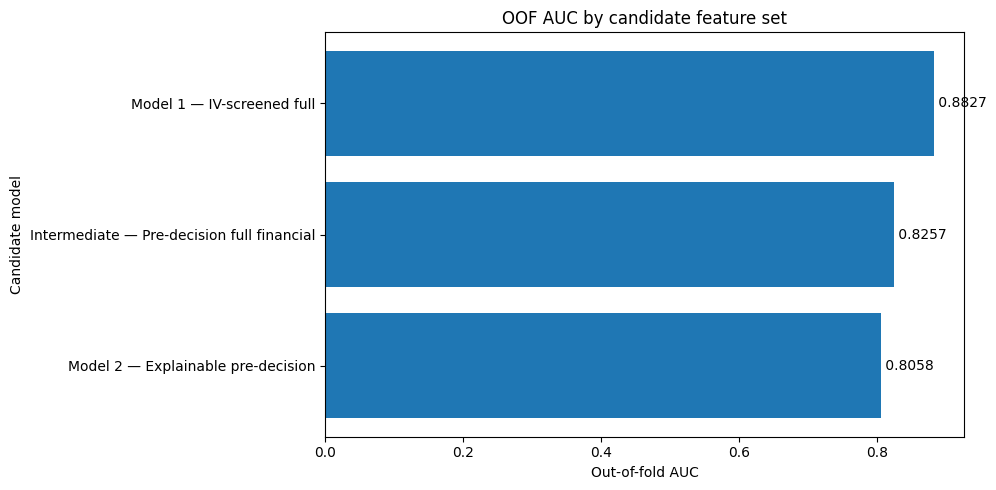
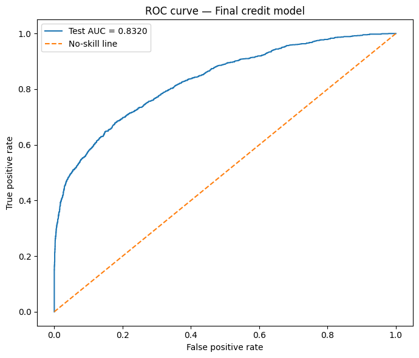
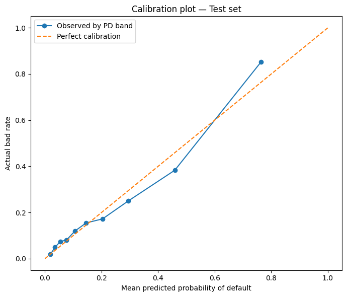
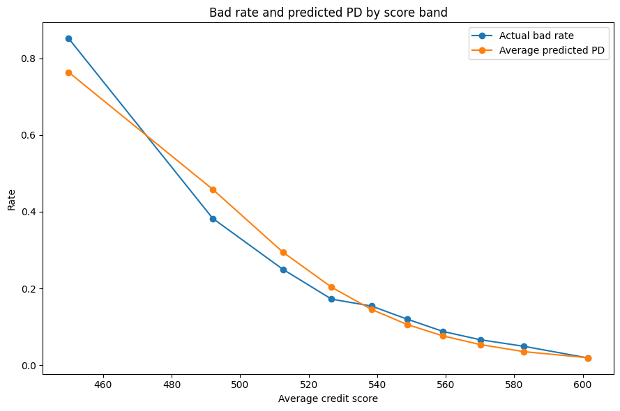
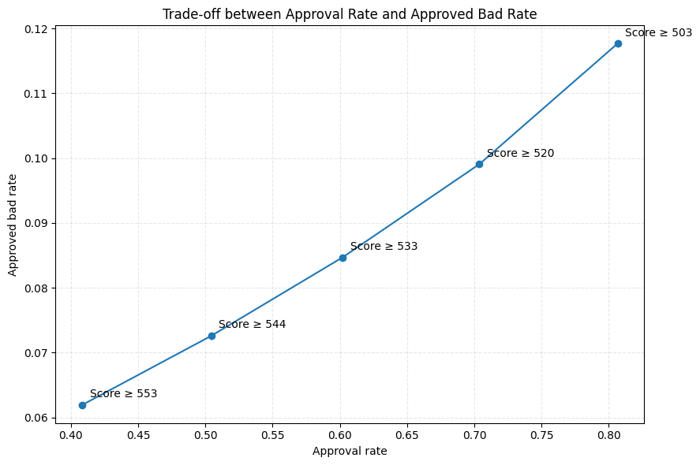

**Project:** Credit Risk Scoring and Decision Support System  
**Team:** Porsche Club, AIO Conquer  
**Contributors:** Trần Phương Bình, Đào Trung Can, Cao Bá Hoàng, Nguyễn Tùng, Vũ Khánh Vy  
**My role:** QA / Reviewer  
**Repository:** [Whoami-404-pip/Credit-Score-Model](https://github.com/Whoami-404-pip/Credit-Score-Model)

> This article is a project report written in the style of a small technical paper. It documents an educational, deployment-oriented prototype. It is not a peer-reviewed study, a bank-approved model, or a recommendation to automate real lending decisions.

## Abstract

Credit risk models operate in a setting where predictive performance is only one part of model quality. A useful lending model must also respect the time at which information becomes available, preserve a traceable relationship between input evidence and output decisions, avoid learning transformations from the evaluation population, and produce artifacts that can be reproduced outside the development notebook. This report presents an end-to-end credit scorecard developed from a public dataset containing 32,581 consumer loan records. The system combines data-quality controls, optimal binning, Weight of Evidence transformation, Information Value screening, logistic regression, conventional points-to-double-the-odds scaling, artifact packaging, and a Streamlit decision-support interface.

Three candidate feature sets were evaluated. The statistically strongest candidate reached an out-of-fold AUC of 0.88270, but it contained `loan_grade` and `loan_int_rate`, variables whose timing may be incompatible with a pre-decision application workflow. The final champion was therefore selected from the business-eligible candidates using stratified ten-fold cross-validation and a one-standard-error rule. It retained seven variables available before the proposed underwriting decision: income, home ownership, employment length, loan intent, loan amount, loan-to-income ratio, and prior default history. On an untouched 20% holdout set, the selected model achieved ROC AUC 0.83197, Gini 0.66394, KS 0.50109, Brier score 0.11289, and log loss 0.37090. Calibration intercept and slope were 0.0357 and 1.0386, respectively.

The project also illustrates why an apparently strong score can be misleading without QA. Earlier development artifacts contained target leakage, inconsistent feature contracts, stale notebook state, and an incorrect score mapping that could differ from the probability-based formula by more than 300 points. The current public pipeline repairs the principal test-leakage and score-identity failures, but important threats remain: duplicate records can cross the random split, anomaly removal disproportionately excludes defaults, the inner cross-validation is not fully nested with respect to WOE fitting, and no out-of-time, external, fairness, or economic validation has been completed. The result should therefore be interpreted as a reproducible scorecard prototype and a case study in model governance, not as a production credit policy.

**Keywords:** credit risk, credit scorecard, Weight of Evidence, optimal binning, logistic regression, calibration, model validation, data leakage, MLOps

## 1. Introduction

A credit scoring system estimates whether a borrower is likely to experience an adverse credit event, such as default, within a defined performance window. The estimate is commonly used to rank applications, define review queues, support pricing, or contribute to an approval policy. In a classroom exercise it is tempting to reduce the task to a leaderboard metric: train several classifiers, report the highest AUC, and stop. In a real decision process, that is insufficient.

The model must answer at least five additional questions. First, which information was actually available when the prediction would have been made? Second, were all preprocessing and feature engineering objects learned without seeing the evaluation target? Third, can the output be explained in terms that an analyst can audit? Fourth, can the exact training transformation be applied consistently to one new applicant and to a batch portfolio? Fifth, do the reported metrics support the business claims being made?

Traditional scorecards remain useful because they provide a relatively direct answer to these questions. Continuous and categorical variables are grouped into risk bins, each bin is represented by Weight of Evidence, and a logistic regression combines those values into a probability of default. The log-odds can then be mapped to a familiar points scale. This design does not guarantee validity, but it makes the model easier to inspect than a system whose feature interactions and transformations are hidden across separate notebooks and application code.

This project was developed by the Porsche Club team in the AIO Conquer program. The work covered exploratory analysis, model development, pipeline engineering, scorecard construction, artifact management, interface development, and QA review. My contribution focused on checking whether the code, documentation, notebooks, and generated artifacts told the same story. That review changed the emphasis of the final report. The main lesson was not that logistic regression is a novel algorithm. It was that a credible model result depends on a chain of evidence extending from source data to deployment behavior.

### 1.1 Research questions

The study was organized around the following questions:

1. Can an interpretable WOE-logistic scorecard provide useful discrimination and probability estimates on the public credit risk dataset?
2. How much apparent performance is lost when variables with questionable decision-time availability are excluded?
3. Can model selection favor a simpler, business-eligible model without selecting solely by the largest AUC?
4. Does the final score preserve the mathematical relationship between default probability, odds, and score points?
5. Which validity risks remain after leakage remediation and artifact synchronization?

### 1.2 Contributions

The practical contributions of the project are:

- a documented dataset audit covering missingness, anomalous values, duplicate contamination, and target balance;
- a train/test pipeline that freezes cleaning, WOE, feature selection, regression, and score scaling artifacts;
- an explicit comparison between a high-performing statistical benchmark and pre-decision feature sets;
- a conventional scorecard transformation with numerical identity checks;
- holdout evaluation of discrimination, calibration, probability error, and score-band ordering;
- a Streamlit interface supporting single-application and CSV batch scoring;
- a QA record showing which earlier results were rejected, which defects were repaired, and which risks remain open.

## 2. Problem Formulation and Scorecard Theory

### 2.1 Binary default prediction

Let `Y = 1` indicate a bad outcome or default and `Y = 0` indicate a good outcome. For applicant features `X`, the model estimates:

```text
PD(X) = P(Y = 1 | X)
```

Logistic regression represents the log-odds of default as an additive function:

```text
logit(PD) = ln(PD / (1 - PD))
          = beta_0 + beta_1 x_1 + ... + beta_k x_k
```

The logistic link constrains the resulting probability to the interval from zero to one. More importantly for scorecards, the additive log-odds representation can be converted into additive points. Each feature can contribute a visible increase or decrease to the final score.

Raw lending variables are rarely linear in risk. A moderate loan amount might be acceptable for a high-income applicant but dangerous for a low-income applicant. Employment length may reduce risk until additional years provide little new information. Categorical variables such as home ownership and loan purpose have no natural numeric spacing. The project addresses these problems through supervised binning and WOE transformation.

### 2.2 Optimal binning

Optimal binning partitions a variable into groups whose outcome distributions are sufficiently distinct while satisfying constraints on size and shape. The project configuration used CART pre-binning, a constraint-programming solver, a maximum of 20 pre-bins, a minimum bin share of 5%, no more than six final bins, and automatic monotonic trend detection.

The constraints serve several purposes. Very small bins create unstable estimates and are difficult to explain. Too many bins can reproduce sample noise rather than a durable risk relationship. A monotonic trend is not always required, but it is often desirable because a scorecard becomes easier to defend when worsening financial conditions do not produce arbitrary reversals in assigned risk.

Missing values are not silently replaced by a global number inside the scorecard. When supported by the preprocessing mode and binning object, missing observations can form a separate bin. This allows missingness to carry its own empirical risk signal. Whether that behavior is appropriate depends on why the value is absent, so the missing bin must still be monitored after deployment.

### 2.3 Weight of Evidence

For bin `j`, this project uses the good-over-bad WOE convention:

```text
WOE_j = ln(DistGood_j / DistBad_j)
```

where `DistGood_j` is the proportion of all good observations falling into bin `j`, and `DistBad_j` is the equivalent proportion among defaults. A positive WOE indicates that the bin contains a relatively larger share of good accounts. A negative WOE indicates concentration of bad accounts.

The sign convention matters. With good-over-bad WOE, a safer bin receives a larger WOE value. The final model coefficients are negative, so an increase in WOE reduces the modeled log-odds of default. That direction is internally coherent:

```text
safer evidence -> higher WOE -> lower logit(PD) -> lower PD -> higher score
```

WOE is useful because it converts non-linear risk patterns into a representation that a linear model can use, handles categorical and numerical variables through a common interface, and produces bin-level contributions that can be translated into score points. It is not automatically safe from leakage. Because WOE uses target distributions, its bin boundaries and values must be learned only from the appropriate training population.

### 2.4 Information Value

Information Value summarizes the separation produced by a variable across its bins:

```text
IV = sum_j (DistGood_j - DistBad_j) * WOE_j
```

The pipeline treated IV below 0.02 as weak and IV above 1.0 as suspicious or potentially unstable. These are screening heuristics, not universal scientific laws. A high IV may reflect a genuinely strong signal, but it may also indicate a proxy for the target, a post-outcome field, or a data-generation artifact. For that reason, statistical screening was followed by a decision-time eligibility review.

### 2.5 Why logistic regression

The selected estimator is deliberately conservative. Gradient boosting or a larger ensemble may achieve higher discrimination, but the scorecard had four priorities: interpretability, additive explanations, stable artifact serialization, and a transparent relationship between probability and score. Logistic regression also provides standard errors, confidence intervals, odds ratios, and sign checks that support a structured model audit.

This choice does not imply that logistic regression is always preferable. A fair benchmark would compare it against non-linear models using the same leakage controls and temporal validation. That experiment was outside the final scope. The conclusions in this report therefore concern the quality of this scorecard implementation, not the superiority of scorecards over all alternatives.

## 3. Dataset and Data Audit

### 3.1 Source data

The public Credit Risk Dataset contains 32,581 rows, eleven predictors, and the target `loan_status`. The target uses `0` for a good loan and `1` for default. The raw class distribution is:

| Outcome | Records | Share |
|---|---:|---:|
| Good loans | 25,473 | 78.18% |
| Defaults | 7,108 | 21.82% |
| Total | 32,581 | 100.00% |

The default rate of 21.82% is high enough to provide a substantial positive class, but it still requires stratification so that train and test partitions preserve comparable event rates.

### 3.2 Variable inventory

| Variable | Type | Meaning | Proposed pre-decision use |
|---|---|---|---|
| `person_age` | numeric | Applicant age | Available, but not selected |
| `person_income` | numeric | Annual income | Selected |
| `person_home_ownership` | categorical | Rent, mortgage, own, or other | Selected |
| `person_emp_length` | numeric | Employment length in years | Selected |
| `loan_intent` | categorical | Stated purpose of the loan | Selected |
| `loan_grade` | categorical | Assigned loan grade | Excluded from champion due timing concern |
| `loan_amnt` | numeric | Requested loan amount | Selected |
| `loan_int_rate` | numeric | Interest rate | Excluded from champion due timing concern |
| `loan_percent_income` | numeric | Loan amount divided by income | Selected |
| `cb_person_default_on_file` | categorical | Prior default indicator | Selected |
| `cb_person_cred_hist_length` | numeric | Credit history length | Available, but not selected |
| `loan_status` | binary target | Observed good or default outcome | Never an input feature |

The decision-time column is essential. A variable can be highly predictive and still be unusable if it is created by the underwriting process that the model is supposed to support. `loan_grade` is an obvious example: if an internal grade is assigned after a credit decision, using it as an input creates circular logic. `loan_int_rate` may also be determined only after pricing or grade assignment. The project therefore retained them in a statistical benchmark but excluded them from the final pre-decision candidate.

### 3.3 Missing data and anomalous values

Two raw fields contain missing values:

| Variable | Missing records | Raw share |
|---|---:|---:|
| `person_emp_length` | 895 | 2.75% |
| `loan_int_rate` | 3,116 | 9.56% |

Exploratory checks also found five ages greater than 100 and implausibly large employment lengths. The notebook-matching preparation removes rows with missing employment length and the extreme age or employment conditions. This produces a modeling population of 31,679 records, a reduction of 902 rows.

The resulting cleaned ranges were plausible for most fields: age from 20 to 94, annual income from 4,000 to 2,039,784, employment length from 0 to 41 years, loan amount from 500 to 35,000, interest rate from 5.42% to 23.22%, loan-to-income ratio from 0 to 0.83, and credit history length from 2 to 30 years. After the row filtering, 3,047 interest-rate values remained missing.

The removal is reproducible, but it is not neutral. Of the 902 excluded records, 619 were good and 283 were bad. The excluded cohort therefore had a bad rate of 31.37%, compared with 21.54% in the retained modeling population. Hard-dropping these rows removes a disproportionately risky group and can make the resulting sample easier than the raw population. A production-oriented policy should investigate the data-generation reason, retain the records where possible, and model missingness explicitly rather than treat replication of the notebook as evidence that the rule is optimal.

For this reason, the codebase exposes two modes:

- `notebook_match` reproduces the historical experiment by applying the hard-drop rules;
- `mlops_optimized` retains the broader population and relies on capping and binning behavior intended for a more robust serving path.

The public configuration defaults to `notebook_match` so that published metrics can be reproduced. The name should not be interpreted as a claim that this mode is the correct production population definition.

### 3.4 Duplicate contamination

QA review of the local `cleaned_dataset.csv` found 157 additional duplicated rows, with 314 rows participating in duplicate groups when both copies are counted. Because the final experiment uses a random row split and the notebook-matching path does not deduplicate the population, identical full-row signatures can appear in both training and test data.

In the audited 80/20 split, 44 full-row signatures crossed the train/test boundary. Earlier multi-partition experiments showed the same pattern across train, validation, and test sets. This does not necessarily mean that every repeated row represents the same real person; the public data has no stable borrower identifier with which to prove entity identity. It does mean that the evaluation can contain exact records already represented in training, which weakens the independence assumption and can slightly inflate apparent holdout performance.

A stronger protocol would define a duplicate policy before splitting, preserve a stable entity key when available, and use group-aware partitioning if multiple loans can belong to the same borrower. Because this was not completed in the current release, the reported test metrics should be read with that limitation attached.

### 3.5 Derived ratio consistency

The dataset includes `loan_percent_income`, but the same concept can be recomputed as `loan_amnt / person_income`. Comparing the supplied and recomputed values showed small differences for most records, consistent with rounding: 28,370 rows differed at any numerical precision, but only 905 differed by more than 0.005 and 385 by more than 0.01. The maximum absolute difference was approximately 0.0934.

This check matters because training and inference must use the same definition. If training consumes the source ratio while the application recomputes a higher-precision ratio, applicants near a bin boundary can receive a different WOE and score. The two preprocessing modes therefore need an explicit feature contract: either preserve the source field for notebook reproduction or recompute it consistently in both training and inference. Silent mixing of the two definitions is not acceptable.

### 3.6 Final modeling population and split

After notebook-matching filters, the modeling population contained 31,679 records:

| Partition | Records | Share | Bad rate |
|---|---:|---:|---:|
| Train | 25,343 | 80% | 21.54% |
| Test | 6,336 | 20% | 21.54% |
| Total | 31,679 | 100% | 21.54% |

The split used `random_state=42` with target stratification. The test target was not used for feature selection, coefficient fitting, threshold tuning for the champion model, or score scaling. However, this is a random holdout from the same source population, not an out-of-time sample. It measures within-dataset generalization under the stated caveats, not temporal stability.

## 4. Development History and QA Remediation

### 4.1 Why model lineage matters

The local Module 2 folder contains exploratory notebooks, candidate datasets, methodology documents, confusion-matrix analysis, framework notes, QA reports, and snapshots created at different stages. These files are valuable evidence, but they do not all describe the same model. Treating every metric in the folder as current would combine incompatible populations, feature sets, and scoring implementations.

The project history can be summarized in three stages:

| Stage | Main purpose | Status in this report |
|---|---|---|
| Legacy exploratory notebook | Rapid EDA, binning, and early regression | Historical only; headline CV metric rejected |
| Candidate scorecard implementation | Integrate model, score scale, and artifacts | Useful for finding contract and score bugs |
| Current public pipeline and notebook | Train/test isolation, pre-decision selection, packaged inference | Primary evidence, with residual limitations |

### 4.2 Rejected leakage-contaminated result

An earlier root notebook fitted optimal binning and WOE on the complete 31,679-row modeling population before running cross-validation. Since WOE values are target-derived, every fold indirectly influenced the transformation applied to every other fold. The reported cross-validation AUC of approximately 0.884428 was therefore an apparent-performance result, not an acceptable estimate of unseen-data performance.

This defect is easy to miss because the final estimator still receives separate train and validation rows. The leakage occurred one level earlier, when target-informed preprocessing was fitted globally. The lesson is that checking only the `model.fit()` call is not enough. Every learned object in the pipeline must be included in the validation boundary.

The current public workflow performs the outer train/test split before fitting the cleaner, WOE transformer, feature selector, and logistic model. The outer test set is transformed only with training-fitted objects. That repairs the principal contamination of the final holdout.

### 4.3 Score mapping failure in an earlier candidate

An earlier scorecard candidate generated numeric bin labels such as `Bin_0`, while the points table expected interval-form keys. The probability model could still produce a plausible PD, but the bin-to-points lookup failed for numerical features. One audited profile had a PD of roughly 1.64%, which corresponds to a score near 605 under the configured scaling, yet the table-based path returned approximately 324. The maximum discrepancy found in that implementation was 318.45 points.

This was not a cosmetic display problem. A decision band based on the incorrect score could reverse the operational outcome even when the probability estimate was correct. The current scorecard implementation therefore validates the mathematical identity between two paths:

1. calculate score directly from predicted probability;
2. calculate score from the model intercept plus feature-level score contributions.

The maximum observed difference in the repaired implementation was `1.1368683772161603e-13` points, effectively floating-point noise.

### 4.4 Other inconsistencies found during review

The development history also included stale notebook state, non-reproducible execution order, differing feature lists of nine, six, and seven variables, missing environment dependencies, artifact/source mismatches, and ambiguity over whether grade and interest rate were available at application time. These issues did not all represent statistical leakage, but together they made it impossible to know which result the interface was serving.

The current repository addresses these problems by centralizing configuration, persisting the cleaner and WOE transformer with the model, recording the selected champion, exporting score tables and metrics, and packaging the artifacts consumed by inference. It also records business eligibility explicitly during candidate comparison.

### 4.5 What has and has not been repaired

It would be inaccurate to summarize the final system as simply "leakage-free." A more precise statement is:

- **Repaired:** the final outer test target is isolated from the fitted cleaner, WOE values, feature selector, regression coefficients, and score scaler.
- **Repaired:** score points are numerically reconciled with probability and model log-odds.
- **Repaired:** the deployment candidate excludes the two fields with the clearest post-decision timing concern.
- **Open:** duplicate full-row signatures cross the random split.
- **Open:** notebook-matching filters remove a higher-risk missing-employment cohort.
- **Open:** WOE is fitted once on the complete outer training set before the ten-fold candidate CV, so the inner CV is not fully nested.
- **Open:** no temporal, external, fairness, or economic validation establishes suitability for a live lending portfolio.

This distinction is central to the report. QA should reduce unsupported claims, not replace one absolute claim with another.

## 5. Experimental Design

### 5.1 Outer holdout protocol

The cleaned modeling population was divided once into an 80% development set and a 20% holdout set. All candidate comparison and feature locking occurred using the development set. The holdout was opened after the champion feature set had been selected.

The high-level order was:

```text
raw data
  -> population rules
  -> stratified 80/20 split
  -> fit cleaner on train; transform test
  -> fit WOE on train; transform test
  -> fit feature selector on train; transform test
  -> compare candidate logistic models on train
  -> lock champion features
  -> fit champion on complete train
  -> evaluate once on test
  -> fit score scale from locked model
  -> export artifacts and reports
```

This ordering prevents direct use of the holdout outcome in model development. It also ensures that the application can serialize the same train-fitted transformation objects that generated the reported test results.

### 5.2 Inner cross-validation caveat

Candidate models were compared with stratified ten-fold cross-validation on the outer training population. The reported candidate metrics are out-of-fold predictions from that process. However, the WOE transformation used by those folds had already been fitted on the full outer training set. Consequently, an inner validation fold contributes to the WOE representation applied to itself.

The impact is less severe than fitting WOE on the outer test set, because the final holdout remains isolated. Nevertheless, candidate CV means and standard errors can be optimistic. A fully nested design would refit binning, WOE, and feature selection separately inside every inner training fold. The current one-standard-error comparison should therefore be interpreted as a pragmatic selection mechanism within the training population, not a perfectly unbiased estimate.

### 5.3 Candidate feature sets

Three branches were compared:

**Candidate 1: IV-screened statistical benchmark, 9 features**

```text
person_income
person_home_ownership
person_emp_length
loan_intent
loan_grade
loan_amnt
loan_int_rate
loan_percent_income
cb_person_default_on_file
```

This branch represents the strongest available scorecard after IV screening. It is valuable as a benchmark, but it is not business-eligible for the intended pre-decision workflow because it contains grade and interest rate.

**Candidate 2: intermediate pre-decision model, 7 features**

```text
person_income
person_home_ownership
person_emp_length
loan_intent
loan_amnt
loan_percent_income
cb_person_default_on_file
```

This branch removes grade and interest rate while retaining requested amount and income in addition to their ratio.

**Candidate 3: compact explainable model, 5 features**

```text
person_home_ownership
person_emp_length
loan_intent
loan_percent_income
cb_person_default_on_file
```

This branch is easier to summarize, but it discards the separate scale information in income and requested amount.

### 5.4 One-standard-error selection rule

Selecting the largest cross-validation mean can favor a more complex model because of sampling noise. The one-standard-error rule instead identifies candidates whose mean performance is statistically close to the best eligible model and then prefers the simpler option among them.

Within the business-eligible candidates, the best mean AUC was 0.82574 and its standard error was 0.00390, producing a one-standard-error threshold of approximately 0.82184. The seven-feature intermediate model met this threshold. The five-feature model, with mean AUC 0.80579, did not. The intermediate model was therefore selected before evaluating the outer test set.

### 5.5 Evaluation measures

No single metric fully describes a credit model:

- **ROC AUC** measures the probability that a randomly selected default receives higher predicted risk than a randomly selected good account.
- **Gini** is `2 * AUC - 1`, a common transformation of ranking performance.
- **KS** is the maximum difference between cumulative score distributions for good and bad outcomes.
- **Brier score** is the mean squared error of predicted probabilities; lower is better.
- **Log loss** penalizes confident incorrect probabilities more heavily; lower is better.
- **Calibration intercept** measures systematic probability bias; the ideal value is zero.
- **Calibration slope** measures whether predictions are too extreme or too compressed; the ideal value is one.
- **Precision, recall, and F1** require a classification threshold and therefore describe a policy point, not the probability model in isolation.

## 6. Candidate Model Results

### 6.1 Cross-validation comparison

| Candidate | Features | Business eligible | OOF AUC | Gini | KS | Brier | Log loss | Mean CV AUC | CV SD | Max VIF |
|---|---:|---|---:|---:|---:|---:|---:|---:|---:|---:|
| IV-screened full | 9 | No | 0.88270 | 0.76540 | 0.63153 | 0.09344 | 0.31837 | 0.88278 | 0.01099 | 4.2209 |
| Intermediate pre-decision | 7 | Yes | 0.82573 | 0.65146 | 0.48821 | 0.11465 | 0.37642 | 0.82574 | 0.01233 | 1.6191 |
| Explainable pre-decision | 5 | Yes | 0.80575 | 0.61150 | 0.45227 | 0.11811 | 0.38774 | 0.80579 | 0.01068 | 1.0580 |



*The full statistical benchmark is strongest, but it is not eligible for the intended pre-decision workflow.*

Removing grade and interest rate from the nine-feature benchmark reduced out-of-fold AUC by 0.05697, Gini by 0.11394, and KS by 0.14332. That is a meaningful loss, not a negligible trade-off. It quantifies how much predictive information those two fields carry in this dataset. It does not justify deploying them when their availability would create circular decision logic.

Reducing the intermediate model from seven to five features cost another 0.01998 AUC and 0.03996 Gini. Brier score worsened from 0.11465 to 0.11811, while log loss increased from 0.37642 to 0.38774. The result suggests that `person_income` and `loan_amnt` contribute information beyond the ratio `loan_percent_income`. Two applicants can have the same ratio but very different absolute financial capacity and exposure.

The seven-feature candidate therefore represents a defensible compromise. It is materially weaker than the post-decision benchmark but stronger than the compact alternative, remains within the eligible one-standard-error region, and preserves a manageable feature contract.

### 6.2 Champion logistic model

The final generalized linear model was fitted on 25,343 training observations using a binomial logit specification. It converged in six IRLS iterations. The log-likelihood was -9,530.6, deviance was 19,061, Pearson chi-square was approximately 26,800, and Cox-Snell pseudo R-squared was 0.2518.

| Term | Coefficient | Standard error | z | 95% CI | Odds ratio |
|---|---:|---:|---:|---:|---:|
| Intercept | -1.319853 | 0.019052 | -69.2746 | [-1.357195, -1.282511] | 0.267175 |
| `person_income` WOE | -0.761879 | 0.032142 | -23.7035 | [-0.824876, -0.698882] | 0.466788 |
| `person_home_ownership` WOE | -0.886518 | 0.031722 | -27.9463 | [-0.948692, -0.824343] | 0.412088 |
| `person_emp_length` WOE | -0.385450 | 0.075886 | -5.0793 | [-0.534185, -0.236716] | 0.680144 |
| `loan_intent` WOE | -1.206978 | 0.058025 | -20.8008 | [-1.320706, -1.093251] | 0.299100 |
| `loan_amnt` WOE | -0.815549 | 0.080429 | -10.1400 | [-0.973187, -0.657912] | 0.442396 |
| `loan_percent_income` WOE | -0.856457 | 0.023129 | -37.0298 | [-0.901789, -0.811125] | 0.424664 |
| `cb_person_default_on_file` WOE | -1.150343 | 0.042973 | -26.7691 | [-1.234568, -1.066118] | 0.316528 |

All selected feature coefficients were statistically different from zero at `p < 0.001` in the fitted training model. Statistical significance should not be confused with causal importance. The coefficients describe associations after WOE transformation within this sample. The odds ratios correspond to a one-unit increase in WOE, not to a one-unit increase in the original raw variable.

### 6.3 Sign and multicollinearity checks

Every selected coefficient was negative in all ten cross-validation fits. The coefficient standard deviations ranged from approximately 0.0052 for loan-to-income WOE to 0.0319 for loan amount WOE. This sign consistency supports the intended good-over-bad WOE convention and suggests that no fold required a reversal to fit the data.

The maximum variance inflation factor for the champion was 1.6191, well below the common diagnostic threshold of five. Retaining both income, loan amount, and their ratio did not create severe linear multicollinearity in WOE space. That result supports the empirical improvement observed over the five-feature candidate.

## 7. Holdout Performance and Calibration

### 7.1 Final test results

After feature locking and final training, the model was evaluated on 6,336 holdout records:

| Metric | Test result | Interpretation |
|---|---:|---|
| ROC AUC | 0.83197 | Good ranking discrimination within this dataset |
| Gini | 0.66394 | Equivalent ranking summary derived from AUC |
| KS | 0.50109 | Clear separation between good and bad distributions |
| Brier score | 0.11289 | Moderate squared probability error |
| Log loss | 0.37090 | Probability quality with heavier penalty for confident errors |
| Calibration intercept | 0.0357 | Small global underprediction tendency |
| Calibration slope | 1.0386 | Probability spread close to the ideal slope of one |



*The ROC curve measures ranking across all possible thresholds. It does not select an approval policy.*

The holdout AUC is 0.00624 higher than the intermediate model's out-of-fold training AUC. Test Gini is higher by 0.01248 and KS by 0.01288, while Brier score is lower by 0.00176 and log loss lower by 0.00552. These small improvements are plausible sampling variation and do not suggest overfitting from the candidate comparison. They also should not be interpreted as proof that the model will improve on future time periods.

| Measure | OOF development | Holdout test | Test minus OOF |
|---|---:|---:|---:|
| AUC | 0.82573 | 0.83197 | +0.00624 |
| Gini | 0.65146 | 0.66394 | +0.01248 |
| KS | 0.48821 | 0.50109 | +0.01288 |
| Brier | 0.11465 | 0.11289 | -0.00176 |
| Log loss | 0.37642 | 0.37090 | -0.00552 |

Duplicate overlap and same-source random splitting remain possible sources of optimism. The stable train-to-test relationship is encouraging, but an out-of-time sample is still required before claiming population stability.

### 7.2 Calibration analysis

Discrimination asks whether risky borrowers rank above safer borrowers. Calibration asks whether a predicted 20% default rate corresponds to approximately 20 defaults per 100 comparable cases. A model can rank well and still provide poor probabilities, which would undermine expected-loss and pricing calculations.



*Global calibration is close to the ideal diagonal, with visible local deviations in several risk groups.*

The ten calibration groups were:

| Decile from low to high risk | Mean predicted PD | Actual bad rate | Records |
|---:|---:|---:|---:|
| 1 | 1.94% | 1.89% | 634 |
| 2 | 3.53% | 4.89% | 634 |
| 3 | 5.39% | 7.39% | 636 |
| 4 | 7.64% | 8.08% | 631 |
| 5 | 10.61% | 11.99% | 634 |
| 6 | 14.58% | 15.48% | 633 |
| 7 | 20.36% | 17.22% | 633 |
| 8 | 29.50% | 25.04% | 635 |
| 9 | 45.89% | 38.29% | 632 |
| 10 | 76.36% | 85.17% | 634 |

The lowest-risk group is calibrated almost exactly. Deciles two through six generally underpredict risk, deciles seven through nine overpredict, and the highest-risk group underpredicts substantially. The global intercept and slope remain close to ideal because positive and negative local deviations partially offset each other.

For decision support, this means the probability output is useful but should not be treated as perfectly calibrated at every risk level. Recalibration using a later validation sample could improve the curve, especially if the model is transferred to a portfolio with a different base default rate.

### 7.3 Threshold-dependent classification

The repository reports precision 0.5116, recall 0.6791, and F1 0.5836 for one selected classification threshold. These values are useful for understanding a specific operating point, but they are not fixed properties of the model. Raising the threshold generally increases precision and reduces recall; lowering it does the opposite.

Different notebook sections also analyze Youden's J and business score cutoffs. Their precision and recall values should not be mixed because they represent different threshold choices. The threshold-independent AUC, KS, Brier, and log-loss results are the primary model comparison evidence. Approval cutoffs belong to a separate policy analysis.

## 8. Scorecard Construction and Validation

### 8.1 Odds and points scaling

The scorecard uses a base score of 600 at good-to-bad odds of 50:1 and 20 points to double the odds. The parameters are:

```text
BaseScore = 600
BaseOdds  = 50
PDO       = 20

Factor = PDO / ln(2)
       = 28.853901

Offset = BaseScore - Factor * ln(BaseOdds)
       = 487.122876
```

For predicted default probability `PD`, bad odds are `PD / (1 - PD)`. The credit score is:

```text
Score = Offset - Factor * ln(PD / (1 - PD))
```

The negative sign ensures that higher default probability produces a lower score. At 50:1 good-to-bad odds, PD is `1 / 51`, or approximately 1.96%, and the score is 600. If the good-to-bad odds double to 100:1, the score becomes 620. If they halve to 25:1, the score becomes 580.

For example, a predicted PD of 2% produces:

```text
log odds = ln(0.02 / 0.98) = -3.8918
score    = 487.1229 - 28.8539 * (-3.8918)
         = approximately 599.4
```

### 8.2 Additive feature points

Substituting the logistic equation into the score equation gives an additive scorecard:

```text
Score = Offset - Factor * beta_0
        - Factor * sum_i(beta_i * WOE_i)
```

The intercept contributes base points of approximately 525.20579. For feature `i` and bin `j`, the feature contribution is:

```text
Points_ij = -Factor * beta_i * WOE_ij
```

Because the selected `beta_i` values are negative, a positive WOE for a safer bin produces positive points. A risky negative-WOE bin subtracts points. The application can therefore explain a final score by listing the points added or removed by each observed bin.

### 8.3 Mathematical identity checks

The repaired scorecard was validated through three numerical relationships:

- the maximum absolute difference between direct probability scaling and additive logit scaling was `1.14e-13` points;
- the correlation between predicted PD and score was `-0.95261`, confirming the expected inverse relationship despite discrete bin effects;
- the exported score calibration showed mean absolute error of approximately 0.6160 points and a variance ratio of 1.0102.

The direct identity test is more important than visual plausibility. A score distribution can look reasonable while individual rows are mapped incorrectly. The prior 318-point failure demonstrated that point tables, bin labels, and serialized transformations must be tested row by row.

### 8.4 Score-band ordering

The holdout scores were divided into ten approximately equal-frequency bands. The general pattern is monotonic: high-score groups contain lower observed default rates, while low-score groups contain substantially higher risk.



*Higher score bands generally correspond to lower predicted and observed default risk.*

| Score interval | Average score | Mean PD | Actual bad rate | Records |
|---|---:|---:|---:|---:|
| 589.907 to 638.772 | 601.48 | 1.94% | 1.89% | 634 |
| 576.177 to 589.907 | 582.82 | 3.53% | 4.92% | 630 |
| 564.581 to 576.177 | 570.09 | 5.37% | 6.64% | 633 |
| 553.441 to 564.581 | 559.24 | 7.63% | 8.79% | 637 |
| 543.998 to 553.441 | 548.74 | 10.61% | 12.01% | 633 |
| 533.190 to 543.998 | 538.32 | 14.55% | 15.42% | 629 |
| 520.084 to 533.190 | 526.69 | 20.32% | 17.21% | 639 |
| 503.118 to 520.084 | 512.47 | 29.47% | 25.00% | 632 |
| 476.319 to 503.118 | 492.00 | 45.85% | 38.27% | 635 |
| 386.537 to 476.319 | 449.95 | 76.36% | 85.17% | 634 |

The ordering supports the operational interpretation of the scale. Local calibration differences remain visible: the model overpredicts risk in several middle-low score bands and underpredicts the worst band. Score bands should therefore be monitored for both ordering and observed rate, not only for population count.

## 9. Cutoff and Decision Policy Analysis

### 9.1 Model output is not policy

A probability model estimates risk. A lending policy decides what to do with that risk. The policy depends on expected loss, loss given default, exposure at default, interest margin, acquisition costs, review capacity, legal constraints, fairness requirements, and portfolio risk appetite. None of those quantities is fully represented by AUC.

The notebook explored several score cutoffs to show the trade-off between approval volume and portfolio quality:

| Approval cutoff | Approval rate | Bad rate among approved | Share of all bads rejected | Good-account rejection rate |
|---:|---:|---:|---:|---:|
| 553 | 40.84% | 6.19% | 88.26% | 51.17% |
| 544 | 50.44% | 7.26% | 83.00% | 40.38% |
| 533 | 60.20% | 8.47% | 76.34% | 29.77% |
| 520 | 70.38% | 9.91% | 67.64% | 19.18% |
| 503 | 80.65% | 11.77% | 55.95% | 9.29% |



*Relaxing the cutoff approves more applicants but increases the observed bad rate among approved accounts.*

A cutoff of 553 produces the cleanest approved portfolio in this table but rejects more than half of the good accounts. A cutoff of 503 preserves much more good business but approves a population with an 11.77% observed bad rate. The table makes clear why a cutoff cannot be selected from model accuracy alone.

### 9.2 Demonstration policy bands

The Streamlit configuration demonstrates three bands:

```text
score >= 533       -> auto-approve demonstration band
503 <= score < 533 -> manual-review demonstration band
score < 503        -> reject demonstration band
```

These thresholds create a useful interface example. They are not approved underwriting rules. The manual-review band illustrates one reason to expose score contributions: borderline applications may require verification, additional documentation, or a second decision system rather than an automatic outcome.

An exploratory constrained search requiring at least 55% approval and no more than 9% bad rate among approvals selected a cutoff near 529. At that point, approval was 63.81%, approved bad rate 8.95%, bad capture 73.48%, and good rejection 25.95%. This is still an in-sample policy exercise on the available evaluation data. The constraints are illustrative and do not represent a lender's validated economics.

### 9.3 Statistical threshold benchmark

The training out-of-fold Youden criterion selected a PD threshold of approximately 0.25341, equivalent to a score near 518.30. It balanced sensitivity of 66.83% and specificity of 81.99%, producing Youden's J of 0.4882.

Youden's J gives equal weight to sensitivity and specificity. Lending costs are rarely symmetric: accepting a future default and rejecting a profitable good borrower have different financial consequences. The Youden point is therefore a statistical reference, not a recommended approval cutoff.

### 9.4 Requirements for a real policy

Before using the score for real decisions, a policy study should at minimum:

1. define the prediction horizon and default event precisely;
2. estimate exposure at default and loss given default;
3. incorporate expected revenue and operational review cost;
4. validate cutoffs on a later, untouched population;
5. test stability under changes in application mix and macroeconomic conditions;
6. complete fairness, legal, adverse-action, and human-override reviews;
7. specify monitoring limits and rollback conditions.

## 10. Reproducible System and MLOps Design

### 10.1 Repository architecture

The repository separates exploratory notebooks from the training and inference path. The main modules are:

```text
main.py
  orchestrates loading, splitting, preprocessing, selection,
  modeling, evaluation, scorecard export, and packaging

src/data_loader.py
  loads the source data and applies population-mode rules

src/preprocessing.py
  fits cleaner behavior and WOE transformations

src/feature_selection.py
  creates candidate branches and audit information

src/model.py
  trains and evaluates logistic candidates

src/scorecard.py
  scales probability/log-odds into score points

src/inference.py
  loads frozen artifacts for single and batch scoring

src/utils.py
  exports tables, plots, run metadata, decisions, and model.zip

app.py
  provides the Streamlit decision-support interface
```

The notebook remains valuable for scientific traceability, but the application does not retrain or reconstruct the transformations from notebook cells. It loads serialized artifacts generated by the pipeline.

### 10.2 Artifact contract

Each completed training run persists the key learned objects:

```text
champion_logistic_model.pkl
cleaner.pkl
woe_transformer.pkl
feature_selector.pkl
score_scaler.pkl
```

The run directory also includes score tables, metrics, plots, feature audits, and decision logs. The core production binaries are packaged into `model.zip`. If configured credentials are available, the package can be synchronized to Hugging Face Hub for the hosted Streamlit application.

Persisting the complete chain matters because a logistic coefficient vector alone is not a usable scorecard. The model expects the same cleaning rules, derived-variable definition, WOE bins, selected column order, and score scale used during validation. Changing any one of those components can invalidate the reported performance or produce incorrect scores.

### 10.3 Reproducible execution

The documented local workflow is:

```bash
git clone https://github.com/Whoami-404-pip/Credit-Score-Model.git
cd Credit-Score-Model
pip install -r requirements.txt
python main.py
streamlit run app.py
```

The training configuration records the preprocessing mode, split ratio, random seed, cross-validation folds, binning constraints, IV range, score base, base odds, PDO, and deployment thresholds. Reproducibility still depends on dependency versions and source data availability. A future release would benefit from a lock file, dataset checksum, schema validation, and an automated end-to-end regression test comparing generated metrics and row-level scores against a known reference artifact.

### 10.4 Inference workflow

At inference time, the application:

1. validates the input schema and converts fields to the expected types;
2. applies the frozen cleaner and feature derivation rules;
3. maps raw values to the fitted WOE bins;
4. orders the champion feature columns;
5. predicts default probability with the serialized logistic model;
6. converts probability and feature contributions into score points;
7. assigns the configured demonstration band;
8. returns an explanation and, for batch mode, downloadable results.

This shared inference engine reduces notebook-to-application drift. It does not eliminate operational risk. Pickle artifacts must come from a trusted source, input limits must be enforced, failures must be logged, and a production deployment should verify model and configuration versions before scoring.

## 11. Decision-Support Interface

### 11.1 Single-application scoring

The first application flow collects one applicant and loan request, then displays predicted default probability, credit score, decision band, and feature-level contribution evidence.


*Single-application scoring with a compact underwriter-oriented explanation.*

The interface is most useful when it shows more than a color and a label. A reviewer should be able to identify whether a low score is driven by debt burden, home ownership, loan purpose, prior default history, or another selected factor. This supports data correction and human review, although it does not by itself satisfy legal adverse-action requirements.

### 11.2 Batch portfolio scoring

The second flow accepts a CSV file and applies the same frozen artifact chain to each row.


*Batch scoring for portfolio simulation and downloadable review.*

Batch mode supports distribution checks, cutoff simulation, and operational testing. It also creates additional requirements: malformed rows should be isolated rather than terminate the full job, output should include a model version, and large uploads should have size and execution limits.

### 11.3 Security boundary

The current access gate is appropriate only for a demonstration. A static passcode in a public application is not production authentication. A real system handling financial information requires server-side identity management, role-based authorization, secure secrets, encrypted transport and storage, audit logs, retention rules, incident response, and restrictions on who can download scored applicant data.

## 12. QA Assessment and Threats to Validity

### 12.1 Evidence supporting the prototype

Several aspects of the final implementation are technically sound and worth preserving:

- the outer holdout is separated before fitting the main learned transformations;
- the feature contract explicitly distinguishes statistical availability from business timing;
- candidate selection is documented instead of silently choosing the largest metric;
- all champion coefficients have coherent signs and low multicollinearity;
- holdout discrimination and global calibration are both reported;
- score points are tested against the probability formula;
- the application loads the frozen transformation chain rather than duplicating notebook logic;
- outputs include model evidence, not only an approval label.

### 12.2 Residual risks

| Risk | Evidence | Likely effect | Required next step |
|---|---|---|---|
| Duplicate overlap | 44 full-row signatures crossed the audited split | Optimistic holdout estimate | Deduplicate or use group-aware split |
| Selection bias | Removed cohort bad rate 31.37% vs 21.54% retained | Easier modeling population | Retain missing cases and model missingness |
| Non-nested inner CV | WOE fitted on full outer train before folds | Optimistic candidate CV estimates | Fit complete pipeline inside every fold |
| No temporal validation | Random split from one public dataset | Unknown drift and vintage stability | Use out-of-time validation |
| No external validation | One source population | Unknown portability | Validate on an independent portfolio |
| No economic model | Cutoffs lack LGD, EAD, margin, and cost | Policy may be unprofitable | Optimize expected value under constraints |
| No fairness audit | No subgroup performance evidence | Unknown disparate impact | Define protected groups and test outcomes |
| Prototype security | Demo gate and public artifacts | Unsuitable for sensitive data | Add production identity and data controls |
| Model risk monitoring absent | No PSI, calibration alert, or rollback rule | Degradation may go undetected | Define monitoring and governance plan |

### 12.3 Internal, external, and construct validity

**Internal validity** is improved by outer holdout isolation and artifact identity testing, but weakened by duplicate overlap and non-nested WOE candidate CV. The final test result is more credible than the legacy global-WOE cross-validation score, yet it is not free from contamination risk.

**External validity** is limited because the data is public, randomly split, and lacks a documented economic or temporal context matching a particular lender. Performance can change sharply across countries, products, underwriting channels, and macroeconomic periods.

**Construct validity** depends on what `loan_status` represents and when it was observed. A production study must define the bad event, performance window, censoring rules, and treatment of early repayment or incomplete observation. The public dataset provides a binary target but not the full account-performance framework required for regulated model development.

**Operational validity** is limited by prototype security, untested concurrency, and the absence of a formal monitoring loop. A working Streamlit demonstration proves that the artifacts can be consumed. It does not prove that the system can safely support live applicants.

### 12.4 Fairness and explainability

Age was available in the raw data but not selected by the champion. Excluding an obvious sensitive or regulated variable does not establish fairness. Other variables can proxy demographic or socioeconomic characteristics, and errors can still differ across groups. A proper review should compare approval rates, true-positive rates, false-positive rates, calibration, and score distributions by legally relevant subgroup, while considering the policy and jurisdiction in which the model would operate.

The feature-point explanation is useful for model transparency, but it is not automatically a causal explanation. A low contribution from home ownership means that the observed category was associated with risk in the training data after binning. It does not prove that changing home ownership would cause the applicant's credit behavior to change.

## 13. Recommended Next Experiments

The highest-value next work is methodological rather than cosmetic:

1. **Create a canonical dataset contract.** Add a stable row or entity identifier, explicit duplicate policy, source checksum, feature definitions, and missing-value semantics.
2. **Rebuild nested validation.** Fit cleaning, binning, WOE, IV selection, and logistic regression independently inside each cross-validation fold.
3. **Add out-of-time testing.** Split by application or origination date instead of random row order when temporal data becomes available.
4. **Quantify uncertainty.** Bootstrap AUC, KS, calibration, cutoff approval, and approved bad rate to provide confidence intervals.
5. **Compare models fairly.** Benchmark monotonic gradient boosting and other interpretable alternatives using identical partitions and feature-timing rules.
6. **Calibrate on a later sample.** Evaluate Platt scaling, isotonic regression, or intercept-only recalibration without contaminating the final test.
7. **Build economic decisioning.** Combine PD with LGD, EAD, revenue, acquisition cost, and review cost rather than optimize a classification statistic.
8. **Complete fairness analysis.** Measure subgroup errors and policy outcomes, document permitted variables, and test explanation requirements.
9. **Add monitoring artifacts.** Record training distributions, score PSI, feature PSI, missingness, calibration drift, and alert thresholds.
10. **Harden deployment.** Replace the demo gate, validate model package signatures, log model versions, and add row-level error handling for batch scoring.

## 14. Discussion

The project demonstrates a common tension in applied machine learning. The strongest statistical model is not always the correct deployment model. The nine-feature candidate achieved an AUC close to 0.883, substantially above the final 0.832 holdout result, but its use of grade and interest rate made the decision process ambiguous. Removing those fields reduced performance, yet produced a feature set that can be described at the proposed application point.

That choice should not be romanticized. A 0.057 AUC reduction can matter economically. The correct response is not to ignore the loss, but to redesign the data and decision process. If the lender can define a preliminary rate or grade using only pre-decision information, that component should be modeled and validated explicitly. If the fields are outcomes of a separate underwriting model, they should not be fed back into an earlier-stage scorer without documenting the dependency.

The QA history also shows why reproducibility is a model-quality attribute. The legacy AUC appeared strong, and the broken score table produced numbers in a plausible consumer-credit range for some applicants. Only a review of fitting order and a direct probability-to-score identity test revealed that the evidence was invalid. Model governance is therefore not an administrative layer added after data science. It is part of the scientific method used to decide which result can be believed.

Finally, interpretability should be understood as a stack. Logistic regression coefficients provide global direction. WOE bins describe local risk groupings. Score points translate those effects into an operational scale. Calibration shows whether probabilities are numerically meaningful. Decision tables show what a cutoff would do to approvals and observed bad rates. Documentation explains feature timing and known limitations. Removing any layer makes the system harder to govern.

## Conclusion

This work produced an interpretable credit risk scoring prototype that connects data preparation, optimal binning, WOE transformation, candidate model selection, logistic regression, score scaling, artifact packaging, and a decision-support interface. The selected seven-feature pre-decision model achieved holdout AUC 0.83197, Gini 0.66394, KS 0.50109, Brier score 0.11289, and log loss 0.37090. Its calibration intercept of 0.0357 and slope of 1.0386 indicate reasonable global probability calibration on the available holdout.

The most important result is not the headline AUC. The project established a defensible link between decision-time features, modeled probability, additive score points, and deployable artifacts. It also preserved the negative evidence: a stronger legacy metric was rejected because of target-informed preprocessing, an earlier scorecard was rejected because its point mapping was mathematically inconsistent, and the current result is presented with unresolved duplicate, selection, nesting, temporal, fairness, economic, and security limitations.

Under those boundaries, the system is a useful educational scorecard and a credible foundation for further model-risk work. It is not yet a validated lending model. Moving from prototype to real decision support requires better population design, fully nested and temporal validation, economic cutoff optimization, subgroup analysis, monitoring, and production security.

## Project Materials

- [Source code and reproducibility notebooks](https://github.com/Whoami-404-pip/Credit-Score-Model)
- [Project technical report](https://github.com/Whoami-404-pip/Credit-Score-Model/blob/main/asset/Tech_Report.pdf)
- [Interactive Streamlit demonstration](https://module-2-porsche-club.streamlit.app/)

## Internal Evidence Reviewed

This report was cross-checked against the local Module 2 working directory, including the cleaned and preprocessed datasets, `model_development_scorecard(1).ipynb`, the methodology and optimal-binning notes, the confusion-matrix analysis, the system framework document, and the dated QA master reviews from July 2026. Historical findings are identified as such and are not presented as metrics from the current public release.
