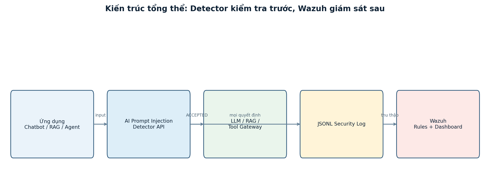
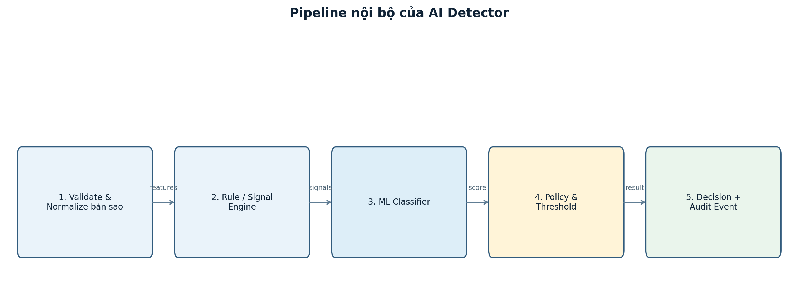
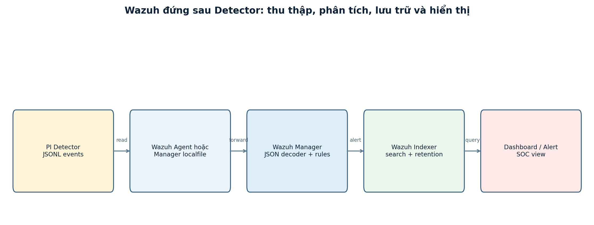
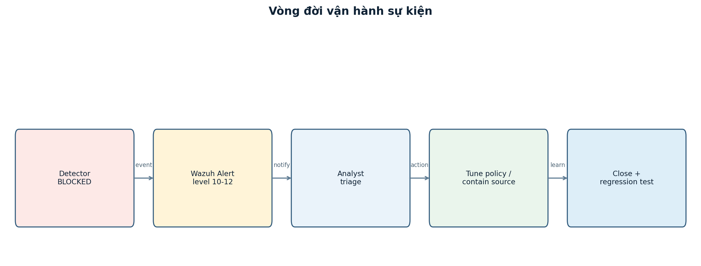

> **Project status -- pre-implementation proposal.** This article documents a planned security pipeline, not a deployed product and not an evaluation report. Implementation is scheduled to begin on **15 August 2026**. Architecture, thresholds, target metrics, diagrams, API contracts, and operational procedures below are design decisions to be tested and revised during implementation. No detection rate, latency, alert volume, or production security outcome is claimed yet.

## Abstract

Large-language-model applications routinely combine developer instructions with lower-trust material: user questions, retrieved documents, websites, emails, tool output, comments, and uploaded files. Prompt injection exploits this composition problem by placing instructions in material that should have been treated as data. The effect can range from an irrelevant answer to system-prompt disclosure, unwanted retrieval, unsafe tool invocation, or attempted data exfiltration. The problem becomes more consequential in retrieval-augmented generation (RAG), GraphRAG, and agentic systems because untrusted content can influence a model that has access to external tools or sensitive context.

This paper proposes **PI Shield**, a pre-implementation, local-first detection and monitoring pipeline for prompt injection in LLM applications. The primary component is a detector placed before untrusted text becomes part of an LLM request. It will validate and normalize an analysis copy of the input, generate explainable rule signals, apply a multi-label classifier, and combine those signals in a policy engine. The engine will return one of three operational decisions: `ACCEPTED`, `REVIEW_REQUIRED`, or `BLOCKED`. Only the application and its tool gateway will act on that decision. Wazuh will operate behind the detector as a monitoring and alerting plane; it will not decide whether a request may proceed.

The proposed research contribution is not a claim that one classifier can solve prompt injection. Instead, it is an auditable control pattern: separate untrusted input from trusted policy, make real-time decisions before the LLM or tool path, preserve minimal structured evidence, and monitor the resulting decisions without logging raw prompts. The implementation plan includes a FastAPI service, a versioned policy and rule package, JSONL audit events, Wazuh ingestion and correlation rules, a source-aware evaluation dataset, adversarial regression tests, and a six-week delivery schedule beginning on 15 August 2026.

**Keywords:** prompt injection, LLM security, RAG security, AI agents, policy enforcement, security telemetry, Wazuh, detection engineering

## 1. Project Status and Research Position

This is a design paper written before the project begins. It records what the system is intended to do, what it explicitly will not do, and how success will be measured once there is an implementation to measure. This distinction is important in AI security work: a clean architecture diagram, a convincing prompt, or a high score on a small hand-written set does not constitute an effective security control.

The project will start on **15 August 2026**. The first implementation milestone will be a small, deterministic detector pipeline with a mock classifier, a stable API contract, and minimized audit logging. Learned models, RAG/agent integrations, Wazuh rules, load testing, and threshold tuning will follow only after the decision and audit contracts are fixed.

The proposal takes a defense-in-depth position:

- A detector can assess untrusted language before it is given influence over an LLM.
- A tool-policy gateway must independently authorize each tool capability and argument.
- An application must still validate model output and preserve user-facing safety behavior.
- Wazuh should collect, correlate, retain, and alert on security events after the request-path decision.
- A human operator remains accountable for policy changes, false-positive review, and high-impact tool actions.

The expected deliverable is therefore a research and engineering prototype for authorized environments. It is not an assurance that all prompt injection is detectable, and it is not a replacement for access control, secret management, sandboxing, output validation, or human review.

## 2. Problem Statement

An LLM does not inherently enforce the distinction between a developer instruction and a sentence retrieved from an untrusted document. Both are represented as text in the context available to the model. This creates a control-boundary problem when an application composes a final prompt such as:

```text
trusted system and developer instructions
        + user request
        + retrieved context
        + tool results
        + conversation history
```

The lower-trust portions may contain language intended to override the application objective, disclose protected material, alter a tool request, or send information to an external destination. In a direct injection, the user types that language into the chat interface. In an indirect injection, it arrives through a document, website, email, record in a vector store, or output returned by a third-party tool.

The central difficulty is that security intent cannot be determined by a small list of forbidden words. A benign security article can discuss system prompts, SQL, shell commands, or data exfiltration. Conversely, a malicious instruction can be split across chunks, encoded, hidden with Unicode or markup, or placed in a document that otherwise appears relevant to a RAG query. The proposed pipeline must therefore make bounded, explainable decisions under uncertainty rather than claiming a perfect semantic classifier.

### 2.1 Assets to protect

The planned threat model prioritizes the following assets:

| Asset | Why it matters |
|---|---|
| System and developer instructions | They encode application objectives, policy, and sometimes implementation detail. |
| Credentials and secrets | API keys, access tokens, database credentials, and signing material must not enter prompts or logs. |
| Private and regulated data | RAG documents, user records, tool output, and internal knowledge may contain sensitive content. |
| Tool authority | Email, file, database, CI/CD, calendar, CRM, and webhooks can create real-world effects. |
| Application objective | An attacker should not be able to replace the user's authorized task with a conflicting one. |
| Evidence and audit history | Investigators need traceable decisions without retaining unnecessary raw content. |

### 2.2 Threat categories

The first dataset taxonomy and rule package will cover six categories. These are labels for analysis, not proof that an input is malicious.

| Category | Intended meaning | Typical source |
|---|---|---|
| `direct_injection` | A user prompt attempts to override higher-priority instructions. | Chat input or API body |
| `indirect_injection` | Untrusted context contains instructions directed at the model. | RAG document, email, webpage |
| `obfuscation` | Hidden text, encoding, homoglyphs, zero-width characters, or deliberate fragmentation conceal content. | HTML, Markdown, Unicode text |
| `data_exfiltration` | Input attempts to expose or transmit protected data. | Prompt, retrieved context, tool output |
| `tool_misuse` | Input attempts to invoke a capability beyond the stated task or granted scope. | Agent workflow |
| `provenance_mismatch` | A source expected to be descriptive contains imperative instructions or unexpected metadata. | RAG/tool integration |

The project will not label every suspicious input as an attack. In particular, training and evaluation will include hard negatives: security documentation, code review requests, benign translations of adversarial examples, and normal administrative language. This is essential because a system that blocks every discussion of security is not useful.

## 3. Research Questions and Design Goals

The implementation will investigate the following research questions.

**RQ1 -- Decision quality.** Can a hybrid of deterministic signals and a calibrated multi-label classifier distinguish likely prompt injection from benign security-related text across chat, RAG, and tool-output sources?

**RQ2 -- Operational safety.** Can an explicit three-way decision contract prevent high-risk untrusted content from reaching an LLM or privileged tool path while allowing a controlled review path for uncertainty?

**RQ3 -- Observability.** Can a privacy-minimized JSONL schema support Wazuh ingestion, alert correlation, dashboards, and incident triage without storing raw prompt text?

**RQ4 -- Reliability.** Do detector failure modes, model unavailability, malformed requests, log rotation, and overload conditions result in predictable, auditable behavior?

**RQ5 -- Usability.** Can the proposed system keep false-positive friction and request latency within application-specific service objectives while retaining meaningful coverage of direct, indirect, and obfuscated inputs?

The corresponding design goals are:

1. Decide before an untrusted input is assembled into the final LLM prompt.
2. Preserve a stable contract that applications can enforce without interpreting free-form model text.
3. Keep policy, rules, model artifacts, and audit schema independently versioned.
4. Prefer bounded mechanisms with safe fallbacks over a second unconstrained LLM acting as judge.
5. Generate enough telemetry for investigation while minimizing sensitive content in logs.
6. Treat tool authorization as a separate, stronger boundary than text classification.

## 4. Scope, Non-Goals, and Assumptions

The initial project scope is text-based input protection for chatbots, RAG/GraphRAG applications, and agent workflows. The detector will be designed as a Python package with a FastAPI wrapper so it can be used locally as a library or shared by multiple services over an authenticated API.

The following are explicitly outside the first implementation scope:

- Perfect prevention of prompt injection, including novel long-context, multi-turn, or multimodal attacks.
- OCR, image, audio, and scanned-PDF analysis. These require their own ingestion and trust pipeline.
- Replacing application authorization, tool access controls, output validation, or approvals.
- Deciding the legal permission of a user to access a target system or document.
- Automated endpoint isolation, source deletion, or other active response based on one alert.
- Treating Wazuh's dashboard state as a real-time authorization decision.

The design assumes that each caller can provide a `source_type`, `app_id`, a correlation `trace_id`, and an intended capability set. It also assumes that the calling application controls its own downstream flow: it must be able to prevent an LLM invocation or tool call when the detector returns `BLOCKED`.

## 5. Trust Boundaries and Security Invariants

The design separates data by trust, rather than assuming a retrieval result is trustworthy simply because it came from an internal vector store.

| Boundary | Examples | Default treatment |
|---|---|---|
| Untrusted | User messages, websites, email, uploads, retrieved chunks, external tool output | Analyze before use; never grant authority merely because content is fluent. |
| Conditionally trusted | Configured policy, signed rule package, approved model artifact | Verify version, checksum, access control, and rollout state. |
| High authority | Tool gateway, secret store, writing database, email sender, deployment system | Default deny; require separate capability checks and, where needed, approval. |
| Observability plane | JSONL writer, Wazuh agent/manager/indexer/dashboard | Receive redacted events after the real-time decision; cannot authorize requests. |

Three invariants guide the design.

```text
I1: No untrusted text reaches the final LLM context without a detector decision.
I2: No detector decision alone grants a privileged tool capability.
I3: No raw prompt, system prompt, credential, or secret is required in Wazuh telemetry.
```

`I1` is an integration requirement, not something the detector can prove from inside its own process. Contract tests will need to demonstrate that a `BLOCKED` input does not result in a request to a mock LLM. `I2` keeps a false negative from becoming automatic privilege escalation. `I3` makes monitoring useful without creating a second repository of highly sensitive text.

## 6. Proposed Architecture

The pipeline deliberately puts the real-time decision at the front. An application sends every untrusted input to the detector before including it in the composed prompt. The detector returns a structured decision. The application and a separate tool gateway enforce that outcome. A minimized JSONL event is written after the decision; Wazuh then collects and correlates that event.



The core flow is:

```text
untrusted input + safe metadata
             |
             v
      POST /v1/analyze
             |
             v
  normalize -> signals -> classifier -> policy
             |
     +-------+--------+
     |       |        |
     v       v        v
 ACCEPTED  REVIEW    BLOCKED
     |       |        |
     v       v        v
 constrained   review/limited     stop before
 LLM path      workflow           LLM/tool path
             |
             v
   minimized JSONL audit event -> Wazuh
```

### 6.1 Why Wazuh is behind the detector

Wazuh is valuable for collection, indexing, correlation, alerting, dashboarding, retention, and incident response. It is not a suitable synchronous authorization engine for an application request. Its rule match occurs after an event has been produced, so moving it in front of the LLM would create ambiguous latency, race conditions, and a false sense of enforcement.

The control-plane split is intentional:

| Question | Responsible component |
|---|---|
| May this input advance now? | Detector policy and calling application |
| May a tool perform this capability with these arguments? | Tool Policy Gateway |
| What was observed across requests and applications? | Wazuh telemetry and correlation |
| Has an analyst reviewed or closed an event? | Case management or incident workflow |

## 7. Decision Contract and Policy Semantics

The detector's output must be small, stable, and executable by normal application code. It will not return a prose recommendation that a backend must interpret. The proposed decision vocabulary is:

| `decision` | Meaning | Required application behavior |
|---|---|---|
| `ACCEPTED` | Input is permitted under the current policy. | Continue, while retaining output and tool guardrails. |
| `REVIEW_REQUIRED` | Risk or uncertainty requires a restricted flow or review. | Do not treat as accepted; disable dangerous capabilities or request approval. |
| `BLOCKED` | Input must not be passed into the LLM/tool path. | Stop the path, return a generic safe response, and record an event. |

Human workflow is deliberately separate from the real-time decision:

```text
decision:      ACCEPTED | REVIEW_REQUIRED | BLOCKED
review_status: UNVIEWED | VIEWED | CLOSED
```

Viewing an alert does not retroactively make input safe. Combining `VIEWED` with `ACCEPTED` or `BLOCKED` would make it unclear whether the backend may call the LLM.

### 7.1 Initial policy proposal

The following ranges are starting hypotheses for the MVP, not validated thresholds. They will be calibrated per source type and capability after the team has a locked validation set.

| Proposed risk score | Proposed level | Proposed decision | Rationale |
|---|---|---|---|
| `0.00 - 0.44` | low | `ACCEPTED` | Continue with normal downstream controls. |
| `0.45 - 0.74` | medium | `REVIEW_REQUIRED` | Preserve a path for ambiguous content without granting unsafe tool access. |
| `0.75 - 0.89` | high | `BLOCKED` | Stop before model or tool invocation. |
| `0.90 - 1.00` | critical | `BLOCKED` | Stop and create a high-priority security event. |

These ranges must not be presented later as scientific constants. An indirect instruction in a retrieved document and a low-risk chat question do not have the same consequences. A write-capable or external-send tool will require a stricter policy than a read-only answer workflow even when the textual risk signal is identical.

### 7.2 Failure policy

The detector will fail predictably rather than silently bypassing itself.

| Failure condition | Planned behavior |
|---|---|
| Invalid schema or unsupported source | Reject request; do not forward malformed content. |
| Input exceeds a hard limit | Reject or request safe segmentation; preserve source metadata. |
| Classifier unavailable | Enter `degraded` rule-only mode, emit health telemetry, and apply stricter policy. |
| Detector timeout | Fail closed for write, send, admin, or destructive capabilities; restricted review path only where an approved read-only policy permits it. |
| Rule/model disagreement | High-consequence rule signals override a low model score; retain structured reason codes. |
| Audit writer failure | Surface health failure and follow an explicit application policy; do not silently claim an auditable decision occurred. |

## 8. Detector Pipeline

The detector will use five bounded layers. Each layer should be unit-testable independently, and no layer should need to inspect or execute the raw content beyond its defined purpose.



### 8.1 Validation and normalization

The API will validate maximum size, encoding, content type, source type, and expected metadata before a request is tokenized. The system will create a normalized **analysis copy** rather than mutating the original application content. This matters because normalization may collapse Unicode forms or expose hidden characters; business code should not receive an unexpectedly transformed input.

Potential analysis signals include:

- zero-width and control characters;
- suspicious homoglyph substitution;
- HTML or CSS hidden-text patterns;
- bounded Base64 or hex-like encoded segments;
- unusual segmentation intended to hide imperative instructions;
- source metadata inconsistent with the content role.

The presence of an encoded string is not sufficient to block a request. A legitimate document may contain an API example, a hash, or source code. The normalizer therefore creates evidence signals; it does not become the policy decision.

### 8.2 Explainable rule and signal engine

Rules provide fast, deterministic coverage and audit-friendly reason codes. The planned rule families include instruction override, role impersonation, system-prompt requests, secret extraction, tool privilege escalation, external exfiltration, encoded instruction, hidden content, and untrusted imperative text.

Each rule will yield a weighted signal rather than a direct allow/block command. A preliminary configuration is shown below solely to document the starting point.

| Signal family | Example intent | Proposed initial weight |
|---|---|---:|
| `instruction_override` | Disregard application objective or higher-priority instructions. | 0.35 |
| `system_prompt_request` | Reveal developer or system instructions. | 0.30 |
| `tool_privilege_escalation` | Trigger a write, delete, deployment, or administration action. | 0.40 |
| `external_exfiltration` | Send protected information to an unapproved URL or webhook. | 0.45 |
| `obfuscation` | Conceal intent using encoding, hidden characters, or markup. | 0.15 |
| `untrusted_instruction` | Imperative content appears in a retrieved document or tool output. | 0.25 |

Weights will be versioned and tested. They are not probability estimates. A score should be calibrated against held-out data rather than treated as a sum of keywords.

### 8.3 Multi-label classifier

The planned baseline is TF-IDF with logistic regression. It is fast, simple to inspect, and provides a necessary benchmark before adding a more complex model. The next candidate will be a small sequence-classification encoder that predicts multiple labels rather than a single benign/malicious flag. Multi-label output allows policy to treat data exfiltration and tool misuse more strictly than an ambiguous formatting anomaly.

The initial classifier requirements are:

- return per-label scores and an explicit artifact version;
- validate tokenizer/model checksums during startup;
- expose a bounded timeout and a clear readiness state;
- support calibration using a validation set and reliability analysis;
- permit quantized or ONNX deployment if CPU and memory testing justify it;
- never be the only security control or direct executor of tools.

Using another generative LLM as a sole safety judge is intentionally excluded from the MVP. It would add a second prompt-injection surface, non-deterministic latency, output-schema risk, and another model whose instruction hierarchy must be protected. A future experiment may compare an LLM-as-judge under strict timeouts and typed outputs, but only against the baseline and never as a silent bypass.

### 8.4 Risk fusion and policy

Let `s_i` be the weighted rule or normalization signals, `m_k` be calibrated model label probabilities, `c` represent requested capabilities, and `q` represent source context. A planned fusion interface is:

```text
raw_score = fuse({s_i}, {m_k}, c, q)
risk_score = calibrate(raw_score, source_type=q.source_type)
decision = policy(risk_score, high_consequence_signals, c, detector_health)
```

The exact function should be selected only after baseline measurement. What must remain invariant is that the policy can apply hard constraints: for example, an `external_exfiltration` signal associated with an external-send capability cannot be neutralized merely because a classifier outputs a low confidence for another label.

## 9. API, Event Schema, and Privacy Boundary

The proposed API is intentionally narrow:

```text
POST /v1/analyze
GET  /health/live
GET  /health/ready
```

An analysis request will contain the text and safe routing metadata:

```json
{
  "text": "<untrusted content>",
  "source_type": "rag_document",
  "app_id": "knowledge-assistant",
  "trace_id": "trc_...",
  "requested_capabilities": ["retrieve", "answer"]
}
```

The response exposes only the fields required for enforcement and correlation:

```json
{
  "decision": "REVIEW_REQUIRED",
  "risk_score": 0.61,
  "risk_level": "medium",
  "attack_type": "indirect_injection",
  "reason_code": "untrusted_instruction",
  "policy_version": "policy-2026-08-15",
  "model_version": "pi-detector-baseline-0.1.0",
  "latency_ms": 0,
  "event_id": "evt_..."
}
```

The numeric value in the example is illustrative. No current service has produced it.

### 9.1 JSONL audit event

The detector will write exactly one minimized JSON object per line. This is easy for a collector to process and lets a Wazuh JSON decoder extract fields without requiring the full input text.

```json
{"schema_version":"1.0","timestamp":"2026-08-15T10:30:00+07:00","event_id":"evt_...","trace_id":"trc_...","event_type":"prompt_injection_detection","app_id":"knowledge-assistant","environment":"demo","source_type":"rag_document","decision":"BLOCKED","risk_level":"critical","risk_score":0.94,"attack_type":"indirect_injection","reason_code":"instruction_override","input_length":684,"prompt_fingerprint":"hmac-sha256:...","model_version":"pi-detector-baseline-0.1.0","policy_version":"policy-2026-08-15","latency_ms":0,"review_status":"UNVIEWED"}
```

The audit schema will not include the raw prompt, full assembled prompt, system instructions, tokens, secrets, or direct PII. If repeated inputs need correlation, the design calls for an HMAC fingerprint with a separate, rotated secret. A plain hash is insufficient for predictable text because it is vulnerable to dictionary-style matching.

## 10. Wazuh Monitoring and Detection Engineering

Wazuh will ingest JSONL events from the detector host using an agent in production-like deployments or a read-only shared volume in a single-host demonstration. The proposed pipeline is shown below.



The data model maps to a small Wazuh rule hierarchy:

| Event condition | Proposed Wazuh level | Intended treatment |
|---|---:|---|
| `ACCEPTED` | 3 | Dashboard telemetry; no notification by default. |
| `REVIEW_REQUIRED` | 7 | Review queue or grouped digest. |
| `BLOCKED` | 10 | Notify according to team SLA and triage. |
| `BLOCKED` with `critical` risk | 12 | Immediate priority alert. |
| Five matching blocked fingerprints in five minutes | 12 | Correlated burst/campaign event. |
| Detector is degraded or unready | 9 | Protection health investigation. |

The exact Wazuh rule IDs, notification routes, and retention settings are implementation artifacts and will be tested in a lab before any external deployment. Wazuh rules should reference structured fields such as `decision`, `risk_level`, `attack_type`, `app_id`, and `prompt_fingerprint`, not parse natural-language detector explanations.

### 10.1 Dashboard questions

A useful dashboard should answer operational questions, rather than merely count alerts:

- Which applications and source types produce the most blocked or review-required events?
- Is a policy or model rollout associated with a sharp change in false positives, decisions, or latency?
- Are several blocked attempts correlated by safe fingerprint, source, or time window?
- Is the detector healthy, and how long does it take for events to reach the alert index?
- Are raw prompts or sensitive data accidentally reaching telemetry?

The proposed dashboard will include decision totals, events over time, attack-type distribution, top application IDs, source types, model/policy versions, latency percentiles, detector health, and a table of recent blocked events. It will not display raw prompt content by default.

### 10.2 Incident lifecycle

The response process starts after the detector has already made the blocking decision.



An analyst should first confirm the `event_id`, `trace_id`, application, source type, requested capability, model version, policy version, and whether the downstream model/tool path was actually skipped. The event can then be classified as a likely true positive, false positive, expected test, or unknown. A false positive should produce a sanitized regression fixture; a likely true positive should lead to source containment, tool-policy review, and a broader test case. Neither response should copy sensitive prompt text into a ticket by default.

## 11. Data and Model Development Plan

Detection quality will be only as credible as the dataset and split design. Randomly splitting near-duplicate jailbreak templates across train and test can produce a misleading score. The project will therefore begin with data governance rather than model selection.

### 11.1 Proposed dataset workflow

1. Define annotation guidance and edge cases before collecting examples.
2. Record source, license/permission, collection date, language, source type, and attack family for every sample.
3. Exclude secrets, personal data, and documents without a valid use right.
4. Deduplicate by template family and semantic similarity before splitting.
5. Split by attack family or provenance, not only at random sentence level.
6. Reserve a holdout from later-collected or unseen sources for generalization testing.
7. Build hard negatives that contain security vocabulary but do not issue malicious instructions.
8. Freeze a regression suite so threshold changes cannot be justified by repeatedly tuning on the final test set.

### 11.2 Evaluation strata

Metrics will be reported separately where enough data exists, at minimum across these strata:

| Dimension | Planned groups |
|---|---|
| Input source | user prompt, RAG document, webpage, email, tool output |
| Attack type | direct, indirect, obfuscation, exfiltration, tool misuse |
| Language/form | Vietnamese, English, code, Markdown, HTML-like content |
| Capability | answer-only, retrieve, read tool, write tool, external-send, admin/destructive |
| Outcome | accepted, review required, blocked, degraded/error path |

This structure allows the team to discover a system that performs well on short English chat prompts but fails on long Vietnamese RAG documents, or one that is acceptable for answer-only chat but unsafe for an agent with external-send capability.

### 11.3 Model comparison protocol

The baseline logistic-regression model will be measured before adding an encoder. The comparison will hold the data split, labels, policy contract, and test harness constant. A more complex model will be adopted only if it improves the relevant quality and operational measures without violating latency and resource limits.

Candidate model artifacts must record:

```text
dataset manifest and split identifier
training code revision and dependency lock
tokenizer and model identifier
checksum and artifact path
per-class validation metrics
calibration method and threshold policy version
hardware, runtime, batch size, and measured latency
```

## 12. Evaluation Methodology and Acceptance Targets

This section specifies **targets**, not achieved metrics. The first report will include confusion matrices, per-class precision/recall/F1, threshold curves, calibration plots, latency percentiles, error rates, and test environment details. A claim will be made only after those artifacts exist and can be inspected.

### 12.1 Planned metrics

| Metric | Why it matters |
|---|---|
| Recall on malicious samples | Measures how many known attack samples were blocked or routed to review. |
| Precision of `BLOCKED` | Measures how often blocked content is genuinely unsafe, limiting user friction. |
| False-positive rate | Tracks benign content incorrectly blocked or reviewed. |
| Macro F1 and per-class F1 | Prevents common classes from hiding poor coverage of rare attack types. |
| Calibration error | Tests whether risk scores correspond to observed rates well enough for policy thresholds. |
| Latency p50/p95/p99 | Measures impact on application experience and queueing risk. |
| Availability and degraded-mode behavior | Verifies the service does not silently disappear during failure. |
| Log completeness and redaction checks | Verifies observability does not become a data leak. |

### 12.2 Initial acceptance targets

The following are deliberately modest gates for an educational prototype. They must be revisited after the dataset is characterized and must never be substituted for security assurance.

| Test group | Initial target to test |
|---|---|
| Benign internal evaluation set | `BLOCKED` false-positive rate no greater than 2%. |
| Locked direct-injection set | Recall of at least 90% for `BLOCKED` or `REVIEW_REQUIRED`. |
| Locked indirect-injection set with provenance | Recall of at least 90% for `BLOCKED` or `REVIEW_REQUIRED`. |
| Obfuscated inputs | No crash; signals generated and recall reported separately. |
| Operational faults | Correct fail mode plus health/audit event. |
| Concurrent load | p95 latency meets an SLO chosen for the demo application. |

The decision to count `REVIEW_REQUIRED` together with `BLOCKED` for malicious-sample recall reflects a triage system, not a claim that review is as strong as blocking. A later report must show the decisions separately, because excessive review routing can merely move the detection burden to humans.

### 12.3 End-to-end test matrix

The integration test suite will include the following scenarios:

1. A benign user request returns `ACCEPTED`, creates a minimized event, and may reach a mock LLM.
2. A direct injection test fixture returns `BLOCKED`, and the mock LLM receives no request.
3. A retrieved chunk containing imperative untrusted text produces `BLOCKED` or `REVIEW_REQUIRED` according to policy.
4. A tool request with write or external-send capability follows a stricter decision and tool-gateway path than answer-only chat.
5. A model artifact failure enters degraded mode and emits a health event.
6. A malformed, oversized, or unsupported request cannot bypass analysis.
7. A log rotation cycle retains required permissions and continues ingestion.
8. Wazuh decodes `ACCEPTED`, `REVIEW_REQUIRED`, `BLOCKED`, critical, and burst fixtures using the expected rules.
9. Dashboard and notification views reveal no raw prompt, secret, or personally identifying data.

## 13. Integration Patterns

### 13.1 Chat application

For ordinary chat, the application sends `source_type=user_prompt`. `ACCEPTED` permits the original input to proceed under normal output safeguards. `REVIEW_REQUIRED` may route to a no-tool response mode or ask the user to clarify. `BLOCKED` prevents the LLM call and returns a concise, non-diagnostic response. The user should not receive the exact rule pattern that triggered a block because that would reveal tuning detail useful for evasion.

### 13.2 RAG and GraphRAG

RAG requires two checks: the user query should be assessed before retrieval, and retrieved chunks or graph nodes should be assessed before prompt assembly. The system must retain safe provenance metadata such as document ID, trust tier, ingestion time, and retrieval score. A blocked chunk should be excluded; if it was essential context, the application should fail explicitly or request review rather than silently answer from incomplete evidence.

The composed prompt can receive a final defense-in-depth check, but this must not cause the system to log the entire assembled prompt. The final inspection should use an in-memory analysis copy and emit only the minimized audit fields.

### 13.3 AI agents and tools

An agent cannot be secured solely by classifying its input. Before every tool invocation, a Tool Policy Gateway must verify capability, parameters, data scope, destination allowlists, identity, and whether human approval is required.

| Tool class | Example | Proposed control |
|---|---|---|
| Read-only | Search or read a document | May be available in restricted review mode with source limits. |
| Write | Update a ticket or create a record | Requires `ACCEPTED`, schema validation, and least privilege. |
| External send | Email, webhook, upload | Requires allowlisted destination and human approval. |
| Destructive/admin | Delete, deploy key, shell command | Default deny, multi-layer authorization, and detailed audit. |

The detector contributes a risk signal; it cannot prove that a tool argument is safe. This separation is central to the proposal.

## 14. Security, Privacy, and Operations Plan

The service will use service-to-service authentication, short-lived tokens or mutual TLS where appropriate, request-size limits, rate limits by application and identity, and least-privilege filesystem permissions. Policy and model artifacts should be read-only, checksummed, versioned, and independently roll-backable. The service container should run non-root, be exposed only on a private network or loopback for a local demo, and avoid mounting the Docker socket, source repository, or secret directories unnecessarily.

Privacy is a design constraint, not a later log-redaction task. The event schema is intentionally based on metadata, reason codes, input length, version markers, and an HMAC fingerprint. Debug logging must be separated from audit logging and cannot become an uncontrolled store of prompts. The team will define retention for development, demo, pilot, and production-like environments only after measuring actual volume and reviewing applicable policy.

Operational health checks will cover API liveness, model readiness, policy/artifact verification, audit-writer health, disk space, Wazuh ingestion delay, alert queue behavior, and dashboard/indexer availability. A degraded detector must be visible as an event, not discovered only after an incident.

## 15. Delivery Roadmap

The intended implementation begins on **15 August 2026**. The schedule below is a proposal and may change after the first dataset and infrastructure measurements.

| Week | Planned scope | Expected evidence |
|---|---|---|
| 1: 15-21 Aug | Threat model, schema v1.0, baseline rules, fixtures | API contract, sample events, test cases |
| 2: 22-28 Aug | FastAPI service, JSONL audit writer, mock classifier | Local MVP, health endpoints, contract tests |
| 3: 29 Aug-4 Sep | Dataset governance, baseline ML, calibration exploration | Dataset manifest, split record, first metric report |
| 4: 5-11 Sep | RAG/agent integration and Wazuh ingestion | End-to-end lab demonstration |
| 5: 12-18 Sep | Adversarial tests, load tests, policy tuning, hardening | Regression suite, latency report, rollback exercise |
| 6: 19-25 Sep | Documentation, demo recording, acceptance review | Release candidate and handover package |

The project will not advance a model simply because its validation loss decreases. A release candidate should require contract tests, adversarial regression tests, model/rule/policy version recording, artifact checksums, log-redaction checks, Wazuh rule tests, and an explicit rollback path.

## 16. Risks, Limitations, and Falsification Criteria

The proposal can fail in useful ways. A high false-positive rate may show that the signal taxonomy is too broad. Low recall against held-out indirect injections may show that the model has learned templates rather than a source-aware pattern. An acceptable classifier score may still be unusable if p95 latency degrades the host application. A well-rendered Wazuh dashboard may be operationally weak if its alerts cannot confirm that the downstream model/tool call was stopped.

The team should treat the following as reasons to revise the design, not hide the result:

- the caller cannot reliably prevent `BLOCKED` inputs from entering the final prompt;
- source metadata is absent, untrusted, or cannot be propagated across RAG/tool boundaries;
- evaluation data has near-duplicate leakage across splits;
- the model scores are poorly calibrated and policy tuning produces unstable behavior;
- observability requires retaining raw prompts to be useful;
- Wazuh alerts are noisy enough that blocked attacks are not reviewed;
- degraded mode permits privileged tool actions without explicit approval;
- the system fails substantially on languages, formats, or sources that the target application requires.

Prompt injection is an adversarial and evolving problem. The right outcome may be a narrower scope, stronger tool constraints, better document provenance, or a decision to disable high-risk agent capabilities. Detection alone should not be used to justify granting a model more authority.

## 17. Conclusion

PI Shield is a planned security architecture for an LLM application, not a completed detector. Its core claim is deliberately narrow: prompt injection should be handled as a trust-boundary and enforcement problem, not merely as a prompt-writing problem. Untrusted text should be inspected before prompt assembly; policy should return a small executable decision; tools should have their own authorization gate; and security operations should receive minimized, versioned evidence after the decision.

The project will begin on 15 August 2026 with a deterministic baseline and stable contracts, then earn more complex components through measurement. The eventual evaluation should report failures as directly as successes: per-source and per-language detection quality, false-positive burden, calibration, latency, failure behavior, policy drift, log redaction, and whether blocked content actually failed to reach downstream model or tool paths.

That is the standard this proposal sets for itself. A polished dashboard or model checkpoint will not be enough. The system must show that its control boundaries, evidence, and failure modes work together under test.

## 18. References and Design Resources

1. [NIST Glossary: Prompt Injection](https://csrc.nist.gov/glossary/term/prompt_injection). Terminology for adversarial instructions that exploit trust boundaries in AI inputs.
2. [OWASP LLM01:2025 Prompt Injection](https://genai.owasp.org/llmrisk/llm01-prompt-injection/). Threat overview covering direct and indirect prompt injection.
3. [OWASP Prompt Injection Prevention Cheat Sheet](https://cheatsheetseries.owasp.org/cheatsheets/LLM_Prompt_Injection_Prevention_Cheat_Sheet.html). Defense-in-depth guidance for LLM applications.
4. [NIST AI 600-1: Generative AI Profile](https://doi.org/10.6028/NIST.AI.600-1). Risk-management considerations across the generative-AI lifecycle.
5. [Wazuh documentation](https://documentation.wazuh.com/current/). Docker deployment, log collection, JSON decoding, custom rules, alerting, and dashboard operations.
6. Primary design artifacts: `01_AI_Prompt_Injection_Detector_A-Z.docx` and `02_Wazuh_Monitoring_Dashboard_Alert_A-Z.docx` in the local project reference directory. They document the proposed API, event schema, monitoring controls, and implementation plan summarized here.
